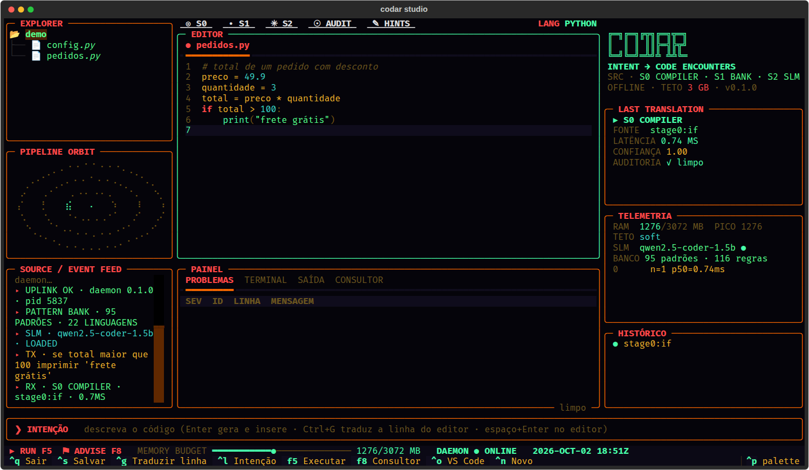
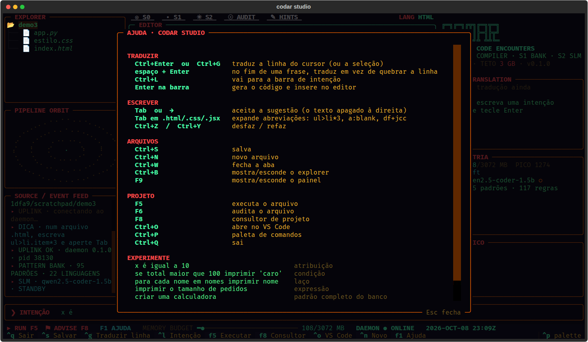

# CODAR

**Você escreve a intenção em pseudocódigo. O CODAR escreve o código.**
Um ambiente de programação para o terminal, com tradução offline, IA local opcional e orçamento de 3 GB de RAM para o daemon.



```text
x é igual a 10                            →  x = 10
imprima a soma de x e y                   →  Write-Output ($x + $y)                (PowerShell)
quantidade é igual ao tamanho de pedidos  →  const quantidade = pedidos.length;    (JavaScript)
se total maior que 100 imprimir 'caro'    →  if total > 100 {                      (Go)
                                                 fmt.Println("caro")
                                             }
ul>li.item$*3                             →  <ul><li class="item1"></li>…</ul>     (HTML, Tab)
df+jcc+aic                                →  display: flex; justify-content: …     (CSS, Tab)
```

> Projeto em fase alfa: o compilador, o banco de padrões e os clientes de terminal estão testados; espere mudanças.

**Versão do código: 0.1.1.** A branch `main` recebe as mudanças mais recentes. Pacotes binários só ficam disponíveis depois que uma tag é compilada e publicada em [Releases](https://github.com/Kelvin-Marques-Cyber/ReAL-Codar/releases). Para instalar ou atualizar a partir do código atual, use o fluxo com `pipx` abaixo.

## Por que existe

Gerar o programa inteiro com IA tem três custos: você para de aprender, não percebe quando a IA errou (ninguém revisa 3 mil linhas) e fica dependente de internet e assinatura.

No CODAR a lógica continua sendo sua. Você escreve linha por linha o que quer, em português ou inglês, e ele traduz para a linguagem escolhida. Se a lógica estiver errada, o código sai com o mesmo erro, e você entende onde errou. O que some é a barreira da sintaxe.

## Como funciona

Cada linha passa por três camadas, da mais barata para a mais cara:

| Camada | O que faz | Tempo típico* |
|---|---|---|
| **0 · Compilador** | Regras determinísticas para atribuições, condições, laços, impressão, contas e expressões em português ("o tamanho de pedidos", "a média entre x e y"), além de abreviações HTML e CSS no estilo Emmet. Sem IA. | < 1 ms |
| **1 · Banco de padrões** | 131 padrões incluídos: calculadora, Dijkstra, CPF/CNPJ (incluindo o CNPJ alfanumérico), Pix copia e cola, widgets Flutter, funções PowerShell, programas de linha de comando, gravação atômica de arquivos, CI, Dockerfile e mais. Usado quando você pede uma funcionalidade ("criar uma calculadora"). | < 5 ms |
| **2 · IA local** | Qwen2.5-Coder 1.5B via llama.cpp, em **modo literal**: traduz só o que a linha diz, sem inventar funções, imports ou dados de exemplo. Usa o código acima do cursor como contexto. | ~2 s |

\* Medido num notebook Intel i7-7500U (2 núcleos, 2016), sem GPU. A primeira frase de cada linguagem que não foi pré-aquecida leva cerca de 10 s.

Além da tradução:

- **Auditoria estática a cada geração**: 117 regras nos plugins, além das verificações de AST Python e segredos. Detecta casos como injeção de SQL e comandos de shell que apagam o próprio arquivo, com sugestões de correção.
- **Consultor de projeto**: "O projeto usa npm. pnpm e Bun instalam as mesmas dependências bem mais rápido…". Você escolhe a opção e ele executa a migração.
- **19 linguagens** de programação: Python, JavaScript, TypeScript, Go, Rust, Java, Kotlin, Swift, Dart, C#, C, C++, PHP, Ruby, Lua, R, Julia, Bash e PowerShell, mais HTML e CSS.

## Instalação

### Código atual da branch `main` (pipx)

Requer **Python 3.10+, Git e pipx**. Execute no seu usuário, sem `sudo`. O extra `studio` instala a interface de terminal; o modelo de IA é opcional e separado.

```bash
pipx install 'codar[studio] @ git+https://github.com/Kelvin-Marques-Cyber/ReAL-Codar.git@main'
pipx ensurepath --prepend
```

Abra um novo terminal depois do `ensurepath`. Em Linux, o executável normalmente fica em `~/.local/bin/codar`; consulte `pipx environment --value PIPX_BIN_DIR` se você personalizou esse diretório.

### Atualizar uma instalação existente com pipx

Feche o Studio antes de atualizar. Este comando busca `main` novamente, inclusive quando dois commits declaram o mesmo número de versão:

```bash
pipx install --force --pip-args='--no-cache-dir' \
  'codar[studio] @ git+https://github.com/Kelvin-Marques-Cyber/ReAL-Codar.git@main'
```

Depois, no Bash ou Zsh:

```bash
export PATH="$(pipx environment --value PIPX_BIN_DIR):$PATH"
hash -r
codar version --verbose
codar restart
codar doctor
codar servir --help
codar toolchains --help
```

O `version --verbose` mostra o caminho do código e o **commit instalado**. Assim você consegue distinguir revisões que ainda têm o mesmo número de versão. `codar version --json` fornece esses dados para scripts. Configurações, modelos e plugins do usuário ficam fora do ambiente do pipx e não são apagados por essa atualização.

No Linux, o instalador também oferece esse fluxo:

```bash
curl -fsSL https://raw.githubusercontent.com/Kelvin-Marques-Cyber/ReAL-Codar/main/packaging/install.sh | sh -s -- --pipx
```

Ele instala/atualiza `main` com Studio e imprime os passos de reinício. Não use `sudo` nesse modo. `pipx upgrade codar` segue a origem registrada na instalação anterior; para mudar de uma instalação antiga/local para este repositório, use o comando completo com `--force` acima.

### Se ainda aparecer a versão antiga

```bash
type -a codar
readlink -f "$(command -v codar)"
pipx list
codar version --verbose
codar status
```

| Resultado | O que verificar |
|---|---|
| `~/.local/bin/codar` aponta para um ambiente `pipx/venvs/codar` | Atualize pelo `pipx`. Instalar um RPM em `/usr/bin` não atualiza essa cópia. |
| `/usr/bin/codar` vem antes no PATH | Use o caminho retornado por `pipx environment --value PIPX_BIN_DIR` ou ajuste o PATH com os comandos acima. |
| `/bin/codar` e `/usr/bin/codar` aparecem juntos | Podem ser o mesmo arquivo por causa de links do sistema; compare com `readlink -f`. |
| `--version` e `status` mostram versões diferentes | O daemon antigo continua na memória. Execute `restart` pelo executável atualizado. |
| A versão continua igual, mas o commit mudou | O código foi atualizado; números de versão não são incrementados a cada commit. |
| `version --verbose` não é reconhecido | Essa CLI é anterior à correção; execute a instalação forçada e confira o caminho do executável. |

O serviço opcional `codar.service` usa **`/usr/bin/codar`**. Se você o ativou e quer passar a usar pipx, pare e desative esse serviço com `systemctl --user disable --now codar`, depois execute o `codar restart` da instalação pipx. Se vai continuar no pacote da distro, use `systemctl --user restart codar` após atualizar o pacote. Reabra o Studio para carregar o código novo.

### Linux, por uma Release publicada

Use esta opção quando houver uma Release com o pacote da sua distro. **O instalador padrão não instala `main` e não atualiza uma instalação pipx.** Sem uma Release disponível, use a opção anterior.

```bash
curl -fsSL https://raw.githubusercontent.com/Kelvin-Marques-Cyber/ReAL-Codar/main/packaging/install.sh | sh
```

O instalador detecta apt, zypper, dnf, pacman ou apk e baixa o pacote da última Release. Para fixar uma versão já publicada, passe `CODAR_VERSION=0.1.1` ao processo `sh`. Se preferir baixar o arquivo manualmente, substitua `<versao>` pelo número do pacote baixado:

| Distro | Comando |
|---|---|
| Debian 12+, Ubuntu 22.04+ | `sudo apt install ./codar_<versao>-1_all.deb` |
| openSUSE Tumbleweed, Leap 16.0 e 15.6 | `sudo zypper install --allow-unsigned-rpm ./codar-<versao>-1.noarch.rpm` |
| Fedora | `sudo dnf install ./codar-<versao>-1.noarch.rpm` |
| Arch | `sudo pacman -U ./codar-<versao>-1-any.pkg.tar.zst` |
| Alpine | `sudo apk add --allow-untrusted ./codar_<versao>-r1_noarch.apk` |

O pacote traz o comando `codar`, a página de manual (`man codar`), o completar com Tab para bash, zsh e fish, os plugins de Neovim e Vim já ativos e um serviço opcional do systemd (`systemctl --user enable --now codar`). Ele depende só do Python 3.10+ do sistema. A cada mudança, o CI instala o pacote em contêineres limpos de todas essas distros, usa o codar e remove o pacote ([docs/PACKAGING.md](docs/PACKAGING.md)).

### Depois de instalar

```bash
codar run "x é igual a 10"     # o compilador e o banco de padrões já funcionam, sem nada extra
codar studio .                  # já disponível se você instalou com [studio]
codar extras install studio     # para quem instalou só o núcleo/pacote da distro
codar doctor                   # confere o ambiente e diz o que falta
```

Para habilitar também a IA local:

```bash
codar extras install llm
codar init                     # configuração e modelo de IA padrão (~1,1 GB)
codar restart
```

Sem o modelo, só as frases que nem o compilador nem o banco entendem ficam sem resposta, com uma mensagem dizendo como instalar o modelo. Testado em Linux, inclusive Ubuntu Server via SSH. O código também cobre macOS e Windows (Named Pipe, Job Object), mas essas plataformas ainda não têm testes automatizados.

## Primeiros passos

```bash
codar run "x é igual a 10"                       # Python é o padrão
codar run -l go "se total maior que 100 imprimir 'caro'"
codar run -l html "ul>li.item\$*3"               # abreviação HTML
codar run "criar uma calculadora" > calc.py       # padrão completo do banco

printf 'x = 10\ny = 20\n' > conta.py
codar run --file conta.py "some os dois números e imprima"   # IA com o arquivo como contexto: print(x + y)

codar compile -l rust algoritmo.txt              # pseudocódigo indentado de várias linhas
codar audit app.py                               # auditoria de um arquivo
codar advise                                     # sugestões para o projeto atual
codar studio .                                   # IDE no terminal
```

O Studio funciona em qualquer terminal, inclusive via SSH; no console puro do Linux (`TERM=linux`) os gráficos viram ASCII. `F1` mostra todos os atalhos.



O Studio também tem explorer de arquivos, abas, terminal integrado, execução com **F5**, auditoria com **F6**, modo de estudo com **F7** e consultor com **F8**. `Ctrl+E`, `Ctrl+T` e `Esc` alternam o foco entre explorer, terminal e editor. `codar explicar -- python app.py` executa um programa e explica erros reconhecidos; também aceita a saída pelo stdin.

### Corrigir e completar código existente

No Studio, selecione o trecho, pressione **Ctrl+L** e descreva a alteração, por exemplo: `corrija a validação sem mudar a assinatura`. A resposta **substitui a seleção**. No VS Code, use **Codar: Traduzir intenção…** com o trecho selecionado.

Sem seleção, pedidos que começam com `corrija`, `refatore`, `reescreva`, `substitua`, `complete`, `melhore` ou `otimize` substituem o **arquivo aberto inteiro**, se ele contém código. Pedidos de criação continuam inserindo código abaixo da linha atual. Para uma alteração pequena, selecione apenas o trecho necessário. **Ctrl+Z** desfaz corpo e imports juntos; o arquivo só é salvo quando você manda salvar.

A edição usa a IA local (S2). O motor recebe o trecho original e o código ao redor, com instruções para devolver uma substituição completa. Se o arquivo mudar durante a geração, a aba for fechada ou a resposta atingir o limite de tokens, o código original é preservado e a resposta fica em **SAÍDA**. A qualidade do resultado depende do modelo: revise a alteração antes de salvar.

O limite de seleção é `router.max_edit_chars` (12.000 caracteres). Isso não aumenta a capacidade do modelo. Se o prompt não couber ou a resposta ficar incompleta, selecione um trecho menor. Para edições maiores, ajuste o contexto e a saída e reinicie o daemon, respeitando a RAM disponível:

```bash
codar config set model.n_ctx 4096
codar config set model.max_tokens 1024
codar restart
```

Pelo terminal, você pode gerar a substituição sem escrever no arquivo original:

```bash
codar run --mode edit --file app.ps1 "refatore preservando os parâmetros" > app-revisado.ps1
```

### Dart, Flutter e PowerShell

O compilador já traduz pseudocódigo para Dart e PowerShell. Os plugins incluídos acrescentam exemplos de **MaterialApp**, **StatelessWidget**, **StatefulWidget**, consumo de JSON em Dart e funções PowerShell com parâmetros e pipeline:

```bash
codar run --local --stages 0,1 -l flutter "criar aplicativo flutter materialapp"
codar run --local --stages 0,1 -l dart "criar widget stateless flutter"
codar run --local --stages 0,1 -l powershell "ler arquivo json powershell"
```

No Studio, **F5** em `lib/` de um projeto Flutter executa `lib/main.dart`; em `test/*_test.dart`, executa `flutter test`. Arquivos Dart comuns usam `dart run`. A detecção procura o `pubspec.yaml` mais próximo dentro da pasta aberta, inclusive em projetos aninhados. **F8** mostra dependências ausentes e oferece `flutter pub get`, `flutter pub add`, `dart pub get` ou `dart pub add` na pasta correta. Imports de `dart:`, do próprio pacote e de bibliotecas já resolvidas não geram instalação indevida.

Para criar um projeto, abra o terminal do Studio (**Ctrl+T**) e use `flutter create meu_app` ou `dart create meu_app`; depois abra essa pasta com `codar studio meu_app`. Em Flutter, selecione o dispositivo quando o comando pedir; `r` e Enter no terminal enviam hot reload. `flutter doctor` identifica os requisitos de Android, web ou desktop que ainda faltam.

### Instalar ferramentas de programação

O CODAR funciona sem SDKs para **gerar** código. Para **executar**, instale as ferramentas necessárias:

```bash
codar toolchains list
codar toolchains install flutter --dry-run  # mostra a origem e a pasta, sem baixar
codar toolchains install flutter           # canal stable; requer Git
codar toolchains install dart              # SDK Dart independente, se ainda não existir
codar toolchains install powershell        # PowerShell 7, comando pwsh
codar toolchains install go rust           # pelo gerenciador do sistema
```

SDKs de Dart e PowerShell são baixados de fontes oficiais e conferidos por **SHA-256**, extraídos numa pasta temporária e publicados só depois da validação. Flutter vem do [repositório oficial](https://github.com/flutter/flutter), branch `stable`; o primeiro uso prepara as dependências do SDK e pode baixar arquivos adicionais. SDKs gerenciados ficam na pasta de dados do CODAR, no seu usuário, sem alterar arquivos do shell. Os terminais do Studio os reconhecem automaticamente. PowerShell portátil ainda depende das bibliotecas nativas do seu sistema.

Python, Node.js/TypeScript, Go, Rust, Java, C/C++, PHP, Ruby e Lua usam o gerenciador disponível: apt, dnf, zypper, pacman, apk, Homebrew ou WinGet. A disponibilidade varia por sistema; ferramentas ausentes no catálogo daquele gerenciador geram uma mensagem clara. Instalações de pacotes do sistema podem solicitar a senha do `sudo` ou elevação do Windows. Instalações existentes são aproveitadas.

Para usar os SDKs gerenciados também fora do Studio, execute no terminal atual:

```bash
eval "$(codar toolchains env)"                    # Bash/Zsh
codar toolchains env --shell fish | source         # Fish
```

No PowerShell: `codar toolchains env --shell powershell | Invoke-Expression`. Fontes e requisitos: [Dart SDK](https://dart.dev/get-dart), [Flutter](https://docs.flutter.dev/install/manual) e [PowerShell](https://learn.microsoft.com/powershell/scripting/install/installing-powershell).

### Ver o projeto no celular

No Studio, **F4** mostra a prévia na rede local com QR Code; **F5** em uma página HTML também abre a prévia. Pelo terminal:

```bash
codar servir .                 # páginas, imagens e gráficos salvos nesta pasta
codar servir --proxy 5173       # repassa um servidor de desenvolvimento local
codar servir . --local         # acesso somente neste computador
```

O celular precisa alcançar o computador pela rede (por exemplo, no mesmo Wi-Fi). Em SSH, o endereço pertence ao servidor remoto e precisa estar acessível ao celular. O programa avisa quando detecta uma possível regra de firewall bloqueando a porta. A prévia de pasta usa um código aleatório na URL e oculta arquivos como `.env` e `.git`; compartilhe somente a pasta necessária, em rede confiável, e pare com `Ctrl+C`. No modo proxy, o conteúdo e as permissões são os do servidor de desenvolvimento.

## Atalhos

Os mesmos gestos em todos os lugares:

| Gesto | O que faz | Onde |
|---|---|---|
| frase + **espaço** + **Enter** | traduz a linha em vez de quebrar a linha (só quando a linha parece uma frase, nunca em código) | Studio, Neovim, Vim, VS Code |
| **Ctrl+Enter** | traduz a linha, ou o bloco selecionado | Studio, Neovim, Vim, VS Code, PowerShell |
| **Ctrl+G** | o mesmo, em terminais que não distinguem Ctrl+Enter | Studio, Neovim, Vim, PowerShell, bash, zsh, fish |
| **Tab** | aceita a sugestão do autocompletar; em `.html`, `.css` e `.jsx` expande abreviações (`ul>li*3`, `a:blank`, `df+jcc`) | Studio |
| **→** | aceita a sugestão (no editor e na barra de intenção) | Studio |
| **Tab** no shell | completa comandos, opções, linguagens, modelos e padrões do `codar` | bash, zsh, fish |
| **F4** | prévia do projeto no celular, com QR Code | Studio |
| **F5** / **F7** | executa o arquivo / abre o modo de estudo | Studio |

O autocompletar do Studio sugere palavras do próprio arquivo, palavras-chave da linguagem e o vocabulário do pseudocódigo ("imprimir", "enquanto", "senão"…). A barra de intenção sugere o que você já pediu e frases de exemplo.

## Editores e terminais

Todos falam com o mesmo daemon local, que sobe sozinho no primeiro uso.

| Onde | Como ativar |
|---|---|
| **Studio** | `codar studio .` (depois de `codar extras install`) |
| **Neovim** 0.10+ | com o pacote do sistema, o plugin já está instalado: ponha `require("codar").setup()` no `init.lua`. Do repositório: `{ dir = "~/ReAL-Codar/clients/nvim", config = function() require("codar").setup() end }` no lazy.nvim |
| **Vim** 8+ | com o pacote do sistema, já está ativo. Do repositório: `set runtimepath+=~/ReAL-Codar/clients/vim` no `.vimrc` |
| **bash / zsh** | `eval "$(codar shell-init bash)"` no `.bashrc`; no `.zshrc`, troque `bash` por `zsh` |
| **fish** | `codar shell-init fish \| source` no `config.fish` |
| **PowerShell** | `Import-Module /usr/share/codar/powershell/Codar` (pacote) ou `Import-Module ./clients/powershell/Codar` (repositório); depois `cdr "x é igual a 10"` e `Enable-CodarKeyHandler` |
| **Qualquer app** | `codar hook install` mostra como criar um atalho global no seu sistema |
| **VS Code** | `code --install-extension codar.vsix` ([clients/vscode](clients/vscode)) |

No Neovim: `:Codar <intenção>` insere abaixo do cursor, `:CodarAudit` mostra a auditoria como diagnósticos, `:CodarAdvise` abre o consultor, `:CodarStatus` mostra RAM e modelo e `:CodarStudio` abre o Studio numa aba. Detalhes em [clients/nvim](clients/nvim) e [clients/vim](clients/vim).

A extensão do **VS Code é atualizada separadamente** da CLI. Para compilar a partir do repositório atualizado:

```bash
cd clients/vscode
npm ci
npm run compile
npm run package
code --install-extension codar.vsix --force
```

Recarregue a janela do VS Code. Se houver instalações duplicadas, configure `codar.executable` com o caminho absoluto da CLI desejada (por exemplo, `/home/kelvin/.local/bin/codar`, substituindo pelo seu usuário).

## Memória: teto de 3 GB

O daemon mede a própria memória (RSS) a cada 2 segundos e age antes de estourar:

- **80% do orçamento**: limpa caches e o estado da IA, mantendo o modelo carregado.
- **92%**: descarrega o modelo. O compilador e o banco continuam respondendo.
- **15 minutos sem uso**: descarrega o modelo e devolve a memória ao sistema.

| Modelo | Arquivo | RAM medida | Acerto* | Licença |
|---|---|---|---|---|
| `qwen2.5-coder-0.5b` | 469 MB | ~0,7 GB | 83% | Apache-2.0 |
| **`qwen2.5-coder-1.5b`** (padrão) | 1066 MB | ~1,3 GB | 88% | Apache-2.0 |
| `qwen2.5-coder-3b` | 2007 MB | ~2,2 GB | 88% | qwen-research (uso não comercial) |

\* pass@1 em 24 tarefas em português, com o código executado contra testes. Detalhes, outros modelos e por que um modelo de 8B não compensa dentro de 3 GB em [docs/BENCHMARKS.md](docs/BENCHMARKS.md).

```bash
codar model list            # modelos, tamanho, RAM estimada e licença
codar model use qwen2.5-coder-0.5b
codar bench --soak 200      # teste de carga: latência por camada, pico de RAM e vazamento
```

O orçamento fica em `[memory] budget_mb` no arquivo de configuração (`codar config path`). No Linux com systemd, o daemon também pede ao sistema um limite rígido de memória quando isso está disponível; o `codar doctor` mostra como ativar.

## Configuração

```bash
codar config path                     # onde fica o config.toml
codar config get model
codar config set model.warm_langs '["python", "powershell"]'
codar restart
```

`warm_langs` define as linguagens que a IA deixa prontas ao carregar. O padrão `["auto"]` aquece as três que você mais usa. O aquecimento roda em segundo plano e cede a vez a qualquer pedido seu.

## Privacidade

A tradução e a auditoria rodam localmente. O daemon escuta só localmente (Unix socket com permissão `0600`, Named Pipe no Windows ou TCP em `127.0.0.1` com token). Instalação, atualização, download de modelos/extras e comandos aprovados no consultor podem acessar a rede. `codar servir` e F4 no Studio compartilham a prévia pela rede quando solicitados; use `--local` para restringi-la ao computador. Programas que você executa no terminal seguem o próprio comportamento de rede.

## Estendendo

Padrões, regras de auditoria, skills e sugestões do consultor são arquivos TOML. Um padrão novo pode trazer testes, e o `patternlint` executa esses testes em cada linguagem antes de aceitar o padrão:

```bash
codar plugins new meu-plugin          # cria a estrutura em ~/.config/codar/plugins/meu-plugin
codar plugins install ./meu-plugin    # valida e instala um plugin local, sem sobrescrever outro
codar plugins list
codar skills list -l dart
codar skills show flutter.widgets
codar patterns add --title "Ler CSV" --keywords "ler csv arquivo" --code-file ler_csv.py -l python
```

Guia completo em [docs/EXTENDING.md](docs/EXTENDING.md). Arquitetura e protocolo em [docs/ARCHITECTURE.md](docs/ARCHITECTURE.md) e [docs/PROTOCOL.md](docs/PROTOCOL.md).

Skills do CODAR são diretrizes TOML usadas pela IA local. Você pode editá-las dentro de um plugin criado com `plugins new`, instalar a pasta com `plugins install` e executar `codar restart`. A instalação valida os arquivos sem executar `plugin.py`; extensões Python de terceiros continuam dependendo da opção explícita `plugins.allow_python`.

## Desenvolvimento

```bash
git clone https://github.com/Kelvin-Marques-Cyber/ReAL-Codar
cd ReAL-Codar
python3 -m venv .venv && source .venv/bin/activate
pip install -e ".[dev,studio]"
python packaging/check_versions.py        # versões dos pacotes, fonte Python e changelog
pytest                                   # motor, compilador, Emmet, roteamento e completar
python -m codar.evals.patternlint        # sintaxe de cada padrão + testes executáveis
tests/clients/run.sh "$(command -v codar)"   # plugins de Neovim e Vim contra o daemon real
```

Veja [CONTRIBUTING.md](CONTRIBUTING.md) e o [histórico de mudanças](CHANGELOG.md).

## Licença

[Apache 2.0](LICENSE). Os modelos de IA não fazem parte do repositório: são baixados por `codar model pull` e cada um segue a licença do autor (veja a tabela acima).

---

**In English:** CODAR turns line-by-line pseudocode (Portuguese or English) into code in 19 languages, plus Emmet-style HTML and CSS abbreviations. A rule-based compiler, a bank of tested patterns and a small local LLM in "literal" mode run 100% offline within a 3 GB RAM budget. It ships a terminal IDE (works over SSH on Ubuntu Server), Neovim, Vim, PowerShell and VS Code clients, shell completion, a static auditor and a project advisor. Packages for Debian/Ubuntu, Fedora, openSUSE, Arch and Alpine. Apache-2.0 licensed.
