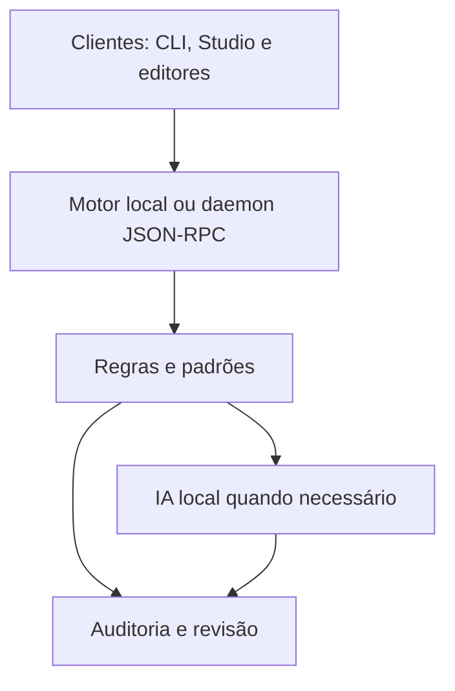

# Arquitetura

O CODAR é um daemon local que mantém o modelo carregado e responde a vários clientes ao mesmo tempo. Os clientes são finos: só montam o pedido, aplicam o resultado no editor e mostram a auditoria.

O compilador tem 19 emissores. HTML/CSS usam abreviações estruturadas; o registro reconhece também YAML e Dockerfile, totalizando 24 tipos de arquivo para contexto e estudo. O daemon usa socket Unix com permissão 0600, Named Pipe ou TCP local autenticado. O Studio pode usar o motor no próprio processo com `--local`.

## Roteamento

A ordem é sempre do mais barato para o mais caro, e cada estágio só responde quando tem certeza.

1. **Estágio 0, compilador.** Em arquivos HTML, CSS, JSX e TSX, abreviações no estilo Emmet (`ul>li*3`, `df+jcc`) são expandidas primeiro (`engine/emmet.py`). Fora isso, converte a frase numa representação intermediária (IR: `Assign`, `If`, `ForEach`, `Print`…) e emite código para cada linguagem. Entende atribuições ("x é igual a 10", "total += preco"), condições, laços, leitura de entrada, funções, classes simples e expressões em português ("o tamanho de pedidos", "a soma de x e y", "o dobro de preco"). Quando a frase descreve um valor que ele não sabe calcular ("o resultado", "o maior de itens"), devolve "não entendi" em vez de gerar texto entre aspas.
2. **Estágio 1, banco de padrões.** Busca em SQLite FTS5 com um léxico bilíngue de conceitos. Só aceita um padrão que explique quase a frase inteira (cobertura ≥ 0,6, ou ≥ 0,8 para pseudocódigo), para que "some os dois números" nunca vire o padrão "somar dígitos".
3. **Estágio 2, IA local.** Duas rotas:
   - **Pseudocódigo** (frase curta, sem palavras de funcionalidade como "criar", "api", "calculadora"): modo literal. O prompt mostra 4 exemplos que o próprio compilador traduziu para a linguagem alvo, o código antes e depois do cursor e a regra "traduza só o que a linha diz". A saída passa por pós-processamento determinístico: corta no primeiro bloco, remove linhas que repetem o contexto, remove imports não usados e remove dados de exemplo inventados (`itens = [1, 2, 3]` antes de `itens.reverse()`).
   - **Pedido livre**: geração com o padrão mais próximo e as skills da linguagem no prompt (RAG), ou composição de padrões com gramática JSON.

## Memória

O teto padrão é 3072 MB de RSS para o processo inteiro. As decisões abaixo vieram de medições num i7-7500U com 16 GB:

| Decisão | Por quê | Efeito medido |
|---|---|---|
| `use_mmap = false` | Com mmap, o llama.cpp reorganiza os pesos para AVX2 numa cópia e os pesos aparecem duas vezes no RSS. | 3B Q4: 3423 MB → 2166 MB |
| `n_batch = n_ubatch = 128` | O buffer de logits ocupa `n_vocab × n_ubatch × 4` bytes; com o padrão de 512 são ~300 MB. | ~230 MB a menos |
| `n_ctx = 1024` | O cache KV cresce com o contexto; pseudocódigo linha a linha raramente passa de 600 tokens. | KV de ~28 MB no modelo 1.5B |
| `CompactRAMCache` (64 MB) | O cache de prefixos do llama-cpp-python guarda os logits de todas as posições (~78 MB por estado) e não conta isso no limite. A versão compacta guarda só a última linha e mede o tamanho real. | 2078 MB → 1408 MB depois de 12 pedidos em 6 linguagens |
| Pré-aquecimento (`warm_langs`) | O prefixo do prompt literal (sistema + exemplos) de cada linguagem fica no cache. | 1º pedido: ~10 s → ~2 s |
| `MALLOC_ARENA_MAX=2`, `malloc_trim`, `gc.freeze` | Evita que o glibc segure memória já liberada por várias threads. | RSS volta a ~100 MB após descarregar |

O `MemGuard` amostra o RSS (incluindo o processo filho no backend `llama_server`) e reage em dois níveis. Antes de carregar um modelo, o daemon lê o cabeçalho GGUF, estima pesos + KV + buffers e recusa o carregamento se a soma passaria do teto duro.

## Imports e referências de bibliotecas

Pedidos limitados a imports usam `engine/imports.py` e um prompt próprio, antes de padrões/RAG/composição. O validador aceita somente declarações nativas completas; propósito da biblioteca não autoriza gerar uma implementação. Código próprio Python é resolvido estaticamente nos arquivos permitidos do projeto.

`libraries.py` lê fontes, tipos e documentação como dados, sem importar/executar pacotes. O catálogo privado separa projeto, linguagem, origem e versão; SHA-256 do conteúdo detecta atualizações. Os prompts de geração, tradução literal e edição recebem um contexto limitado dessas referências. O hash/contexto participa da chave do cache de tradução. Imports não usam esse cache, para revalidar a origem dos módulos próprios.

A consulta ocorre fora do event loop e tem limites de leitura e contexto. Referências manuais estendem a cobertura a todos os formatos; APIs sem fontes/tipos/documentação permanecem desconhecidas. `library_packages.py` gera planos de instalação explícita com argumentos separados, executados pelo gerenciador do projeto. [Contrato e exemplos](LIBRARIES.md).

## Concorrência e cancelamento

O daemon é um único processo asyncio. A IA roda numa thread dedicada com fila, porque o llama.cpp não é reentrante; o compilador, o banco e o auditor respondem no event loop sem esperar a IA. Cada conexão aceita até 8 pedidos simultâneos e pedidos de até 2048 KB por padrão, com snapshots individuais de até 512 KB. `$/cancelRequest` interrompe a geração no próximo token. Os tokens chegam ao cliente como notificações `$/progress`.

## Clientes

| Cliente | Transporte | Observação |
|---|---|---|
| CLI, REPL, hooks de shell | socket direto (`codar.client`, só biblioteca padrão) | `codar run` lê intenção do stdin; `--each` traduz uma intenção por linha |
| Studio (Textual) | socket direto | editor com abas, explorer, terminal, auditoria e consultor |
| VS Code | socket/pipe/TCP em TypeScript | edição atômica com checagem de versão; um único Ctrl+Z desfaz |
| Neovim | libuv (`vim.uv`) | sem subprocesso por tradução; checa `changedtick` antes de aplicar; o espaço+Enter observa a quebra de linha (`TextChangedI`) em vez de remapear o Enter |
| Vim 8+ | `codar run --json` via `job_start` | assíncrono; contexto em arquivo temporário |
| PowerShell 5.1/7 | NamedPipeClientStream / UnixDomainSocketEndPoint / TcpClient | pipeline (`'x vale 1' \| cdr`), PSReadLine Ctrl+G |

## Studio e recursos locais

A busca literal lê o buffer do arquivo ou o projeto sem precisar de daemon/IA. A busca contextual pede ao modelo somente palavras-chave; os resultados são produzidos pelo scanner limitado ao projeto. O módulo de estudo reúne exemplos próprios e exemplos compilados para cada linguagem, catálogo, fontes oficiais e prática registrada por projeto.

Seleções de runtime são persistidas nos dados do CODAR e herdadas pelas subpastas. O ambiente dos novos processos recebe o interpretador escolhido; o processo do CODAR mantém seu próprio Python. No POSIX, wrappers privados para python/python3/pip/pip3 preservam a identidade do venv.

Autosave é opcional e usa uma pausa após a última alteração. A gravação troca o arquivo por um temporário no mesmo diretório, preserva permissões e compara os bytes originais antes da troca. Mudanças externas pausam a aba; o buffer permanece disponível. A comparação reduz o risco de conflito, mas não oferece uma transação com editores externos que escrevam simultaneamente.
