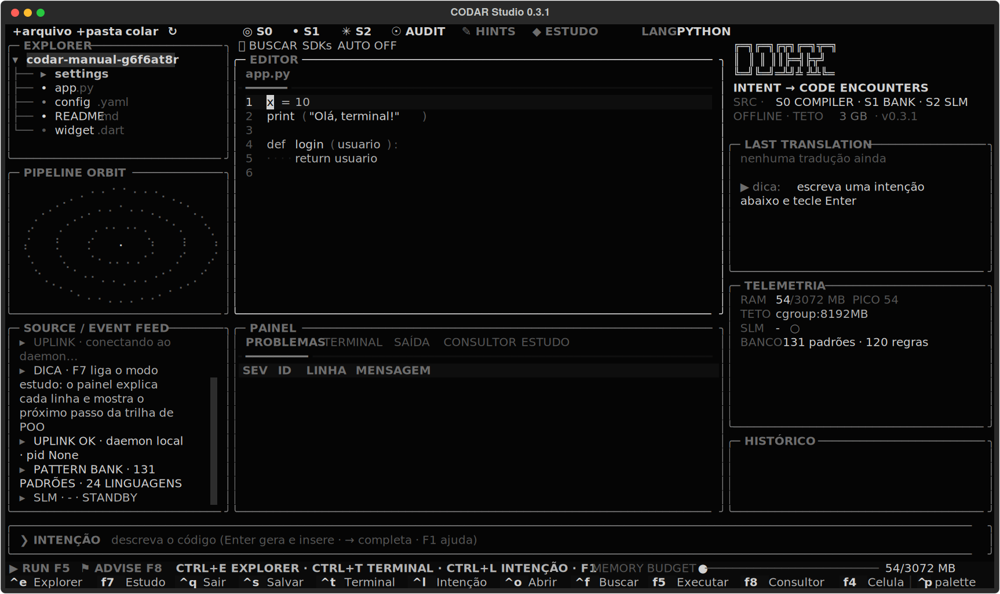
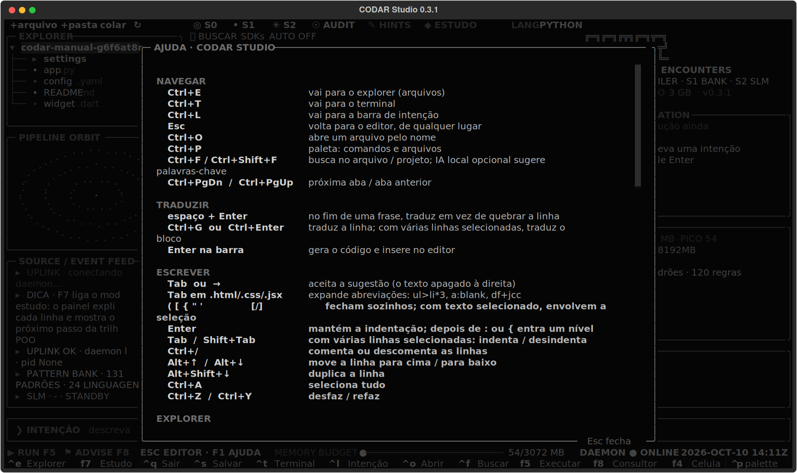
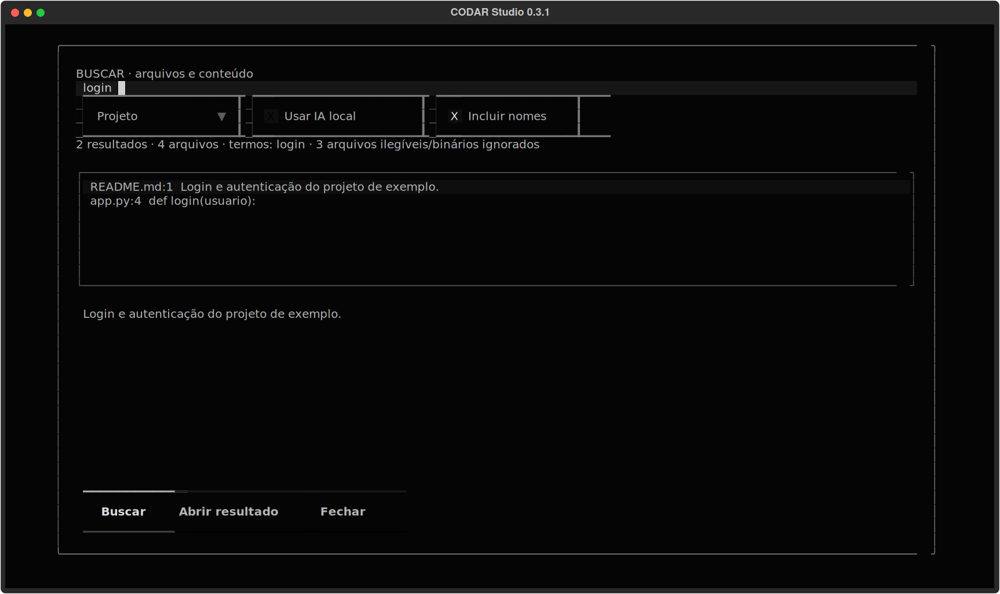
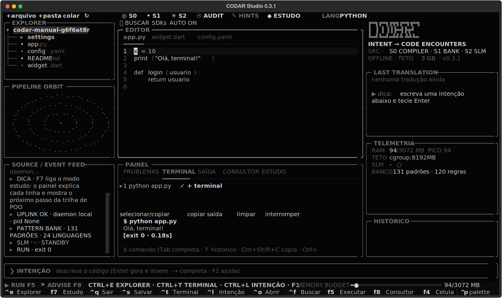
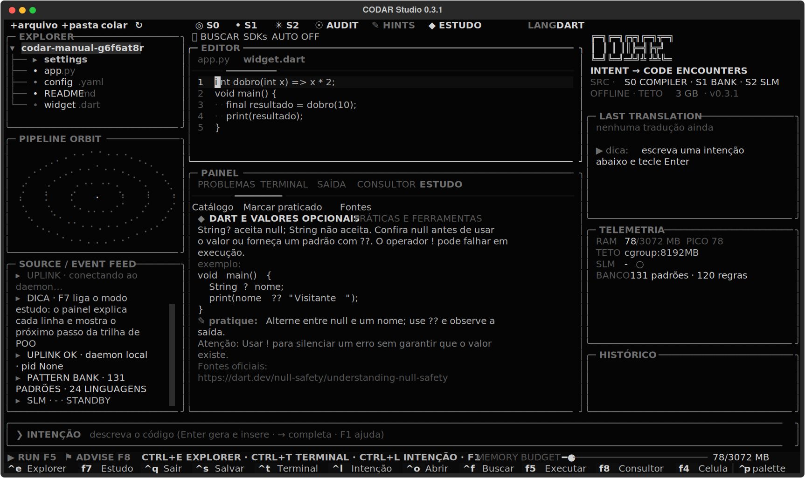
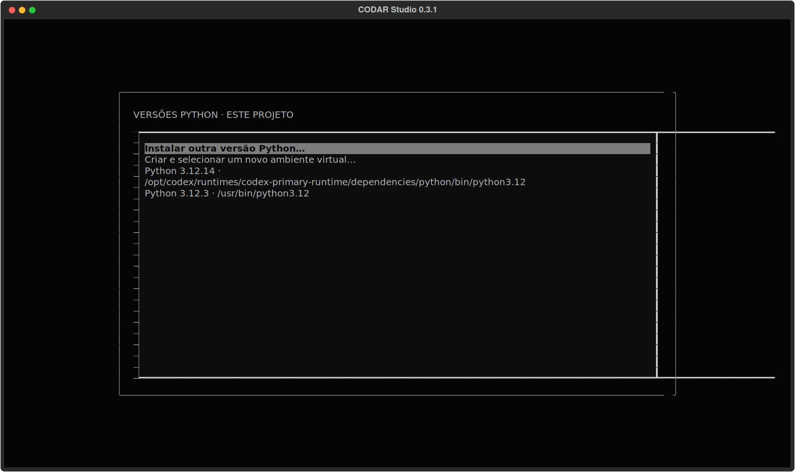
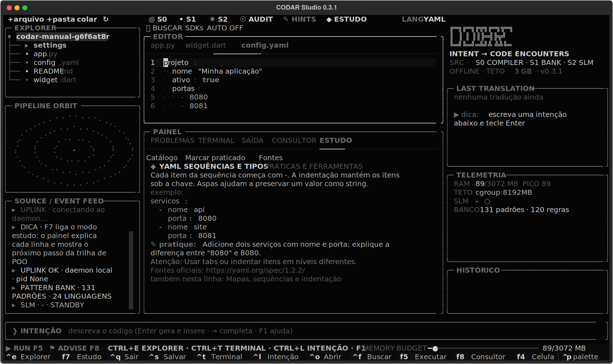
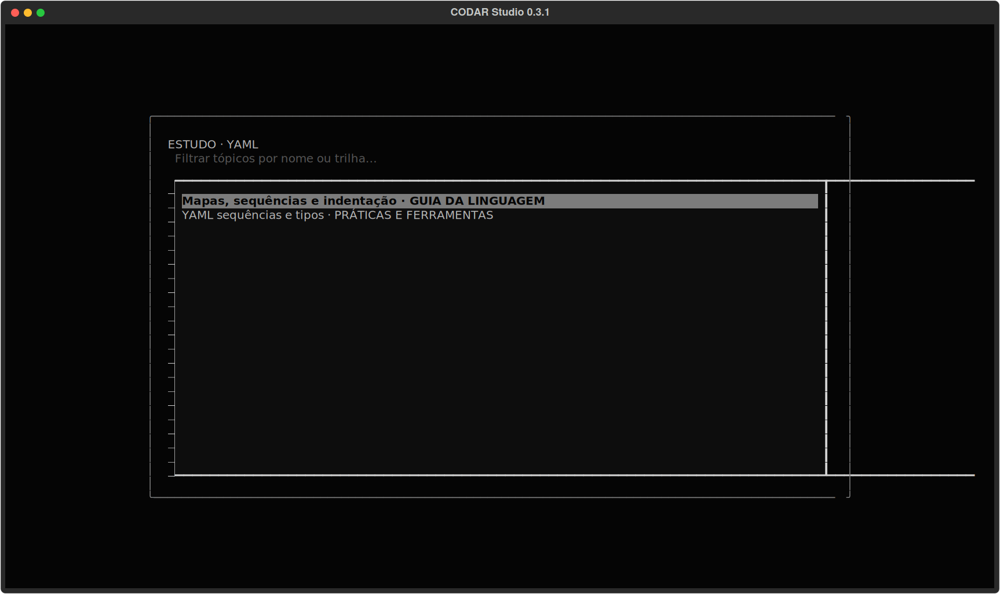
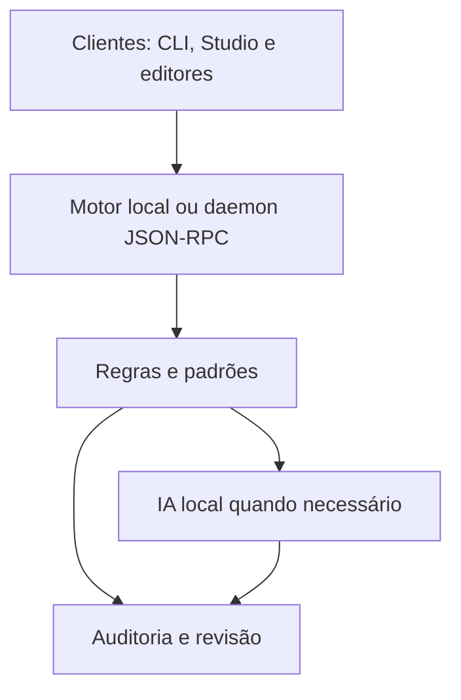

# Manual do CODAR

Versão 0.3.1 • 10 de outubro de 2026

Kelvin e Silva Marques

Programação por intenção, CLI, Studio e integrações de editor. Este manual reúne o uso diário e a referência técnica do projeto em um único documento. O CODAR está em fase alfa; as notas de cada Release identificam os testes e os sistemas verificados.

As capturas foram exportadas da interface real do Studio em Linux, usando o driver de teste do Textual. O terminal da captura executou o programa de exemplo. A IA não foi carregada nas capturas nem nas quatro demonstrações; a busca contextual e a geração livre precisam de um modelo instalado.

## Como consultar

| Quero fazer | Onde consultar |
|---|---|
| Instalar, atualizar e conferir a versão | Instalação |
| Traduzir pseudocódigo e editar o projeto | Primeiros passos |
| Buscar, ativar autosave ou estudar | Primeiros passos e Atalhos |
| Usar Dart, Flutter, PowerShell ou outra versão Python | Primeiros passos e catálogo por linguagem |
| Usar o VS Code | Editores e terminais e guia da extensão |
| Criar plugins e skills | Estendendo e Referência de extensão |
| Entender transporte, contexto e histórico | Arquitetura e Protocolo |
| Gerar uma Release e verificar os pacotes | Empacotamento |



Os comandos de terminal que incluem caminhos de exemplo devem ser ajustados para a sua pasta. No PowerShell, use os caminhos e escapes próprios do shell. Execute `codar COMANDO --help` para ver a lista completa de opções da instalação em uso.

## Por que existe

Quando a geração de código substitui também o raciocínio e a revisão, você pode aprender menos, deixar erros passarem e depender da ferramenta para continuar.

O CODAR foi criado para manter você envolvido na programação. Você escreve a intenção em pseudocódigo, linha por linha, em português ou inglês, e acompanha a tradução para a linguagem escolhida. O compilador e os padrões ajudam com a sintaxe; a IA local amplia os pedidos possíveis. O código gerado continua precisando de revisão e testes.

A CLI é o fluxo principal. O Studio oferece um editor no terminal, inclusive via SSH; as integrações com VS Code, Neovim, Vim e PowerShell permitem usar o mesmo motor no seu ambiente de trabalho.

## Como funciona

Na tradução de intenções, o motor tenta resolver o pedido por regras, depois por padrões e, quando necessário, pela IA local:

| Camada | O que faz | Tempo típico* |
|---|---|---|
| **0 · Compilador** | Regras determinísticas para atribuições, condições, laços, impressão, contas e expressões em português ("o tamanho de pedidos", "a média entre x e y"), além de abreviações HTML e CSS no estilo Emmet. Sem IA. | < 1 ms |
| **1 · Banco de padrões** | 131 padrões incluídos: calculadora, Dijkstra, CPF/CNPJ (incluindo o CNPJ alfanumérico), Pix copia e cola, widgets Flutter, funções PowerShell, programas de linha de comando, gravação atômica de arquivos, CI, Dockerfile e mais. Usado quando você pede uma funcionalidade ("criar uma calculadora"). | < 5 ms |
| **2 · IA local** | Qwen2.5-Coder 1.5B via llama.cpp, opcional. Para pseudocódigo, o prompt pede tradução literal e usa o contexto disponível. Correções, complementos e refatorações usam um modo de edição com o código existente como referência. | ~2 s |

\* Medições de geração registradas em [docs/BENCHMARKS.md](BENCHMARKS.md), num notebook Intel i7-7500U (2 núcleos, 2016), sem GPU. A primeira frase de cada linguagem que não foi pré-aquecida leva cerca de 10 s. Esses números não são um novo benchmark de qualidade das edições da versão 0.3.0.

O compilador e o banco de padrões funcionam sem instalar um modelo. Com modelos e dependências já disponíveis na máquina, a tradução e a auditoria funcionam offline. Instalação, atualização e downloads de modelos, SDKs e dependências usam a rede; veja também a seção **Privacidade**.

## Leve para começar, completo para crescer

**Você pode programar sem carregar um modelo de IA.** Regras, padrões, auditoria e histórico funcionam localmente; o Studio acrescenta arquivos, abas e terminal. Na medição sem IA da 0.3.1:

| Cenário | RAM depois das traduções (mediana de 3 execuções) | Faixa observada |
|---|---|---|
| Motor local: 20 traduções por regras e uma calculadora por padrão | **25,8 MiB** | 25,80–25,81 MiB |
| Studio + motor: três abas de 200 linhas, as mesmas traduções e uma intenção aplicada no editor | **60,3 MiB** | 60,24–60,31 MiB |

RSS medido no Linux x86_64, Python 3.12.14 e Textual 8.2.8, em processos novos. O Studio foi executado com o driver headless do Textual, em 150 × 42 células. Esses valores incluem o motor no mesmo processo; não incluem modelo, daemon separado, emulador de terminal, servidores de linguagem ou programas executados pelo usuário. [Resultados e método reproduzível](BENCHMARKS.md#memória-sem-ia-031).

**Com IA, o consumo muda:** o benchmark anterior do daemon com Qwen2.5-Coder 1.5B registrou cerca de 1,27–1,41 GB. Isso não é uma medição nova da 0.3.1. O orçamento padrão de **3072 MiB** é configurável e se aplica ao serviço/motor monitorado; não representa a RAM de todo o ambiente de desenvolvimento. O monitor limpa caches e descarrega o modelo sob pressão; limites do sistema operacional são usados quando disponíveis.

Outras vantagens no trabalho diário:

- **Terminal e SSH:** trabalhe na máquina local ou num servidor sem precisar de um desktop gráfico.
- **Sem GPU obrigatória:** regras e padrões funcionam sem IA; o backend local também oferece execução do modelo pela CPU.
- **Sem assinatura de IA para traduzir:** o motor roda na sua máquina; depois dos downloads necessários, a tradução funciona offline.
- **Instale o que usa:** o núcleo não exige bibliotecas externas no Python 3.11+; Studio, gramáticas e IA são extras opcionais. No Python 3.10, o núcleo usa `tomli`.
- **Menos espera nas intenções comuns:** regras e padrões respondem sem inferência, com as latências registradas acima.
- **Acompanhe e desfaça:** veja propostas, escolha alterações, consulte o histórico e restaure versões. A lógica e a revisão continuam nas suas mãos.
- **Adapte ao projeto:** skills, plugins e comandos configuráveis permitem ampliar o ambiente e reutilizar convenções.

## O que já está disponível na versão 0.3.0

- **19 linguagens** de programação: Python, JavaScript, TypeScript, Go, Rust, Java, Kotlin, Swift, Dart, C#, C, C++, PHP, Ruby, Lua, R, Julia, Bash e PowerShell, mais HTML e CSS.
- **Correção e complemento do código existente**: uma edição substitui o trecho aprovado. A geração reserva espaço para uma resposta completa e os arquivos grandes são divididos por declarações inteiras; respostas incompletas são recusadas. A validação também rejeita novas definições Python duplicadas.
- **Revisão de até oito arquivos**: veja a comparação entre originais e propostas, escolha os trechos a aplicar e consulte o histórico. Há restauração e recuperação de operações interrompidas; alterações externas são conferidas antes de escrever.
- **Contexto por projeto**: `codar.toml` reúne convenções, skills, requisitos de SDKs e comandos. `codar check` verifica sintaxe; testes, análise e formatação são executados quando você solicita.
- **Dart/Flutter e PowerShell**: padrões, skills e validadores específicos. O Studio reconhece projetos Flutter, executa apps e testes e oferece comandos de dependências na pasta correta, inclusive em projetos aninhados.
- **SDKs e dependências**: `codar toolchains` detecta e instala ambientes por comando explícito; `--dry-run` mostra o plano. Dart e PowerShell usam downloads oficiais com SHA-256; Flutter usa o repositório oficial. As instalações gerenciadas ficam nos dados do seu usuário.
- **Plugins com recuperação**: instalar de pasta ou Git HTTPS, conferir origem, revisão, compatibilidade e dependências, atualizar, desativar, remover e restaurar versões guardadas. Uma atualização inválida preserva a instalação anterior.
- **Studio e editores**: explorador, abas, terminal integrado, execução, modo de estudo e explicação de erros. Studio e VS Code oferecem prévias de edições e histórico; Neovim, Vim e PowerShell também têm integrações.
- **Prévia no celular**: `codar servir` e F4 no Studio mostram projetos pela rede local com QR Code, incluindo proxy para um servidor de desenvolvimento.
- **Auditoria estática**: 117 regras nos plugins, além das verificações de AST Python e segredos, para apontar casos como credenciais no código e SQL concatenado, com sugestões de correção.
- **Consultor de projeto**: sugestões para o ambiente e dependências, incluindo migrações de npm para pnpm ou Bun. Você escolhe a ação a executar.
- **Atualização e distribuição**: versões dos componentes sincronizadas, diagnóstico de instalações duplicadas ou daemon antigo e arquivos publicados para Linux, Windows e macOS. Windows/macOS requerem Python 3.10+ e pipx; a extensão VS Code é instalada separadamente.

O [CHANGELOG](../CHANGELOG.md) separa as mudanças por versão. As [notas da Release v0.3.0](https://github.com/Kelvin-Marques-Cyber/ReAL-Codar/releases/tag/v0.3.0) registram os testes executados e as plataformas ainda sem validação nativa nesta publicação.

### Correções e praticidade na 0.3.1

- **Ctrl+Enter respeita o foco**: na barra de intenção envia o pedido; no editor traduz a seleção exata ou, sem seleção, a linha do cursor; no terminal envia o comando. Ctrl+G é a alternativa para terminais que não distinguem Ctrl+Enter. A seleção termina antes da linha seguinte quando o fim está na coluna zero. Mover o cursor depois de enviar não muda o alvo capturado; se o texto mudar, a resposta fica na saída para revisão.
- **Seu arquivo entra no pedido**: por exemplo, `crie uma interface gráfica com base no arquivo.py`. O Studio encontra e abre o arquivo da pasta do projeto, usa seu código como contexto e mostra uma prévia de substituição. Se houver nomes repetidos, você escolhe o caminho. Cite até oito arquivos para edição de projeto.
- **Terminal com Tab/Shift+Tab**: completa caminhos, comandos disponíveis, histórico e scripts do projeto, incluindo nomes com espaços e a pasta atual após `cd`. Ações de copiar, selecionar, limpar e interromper ficam visíveis na barra.
- **Copiar sem perder texto**: Ctrl+Shift+C copia a saída do terminal ativo; Ctrl+Shift+A abre uma janela para selecionar com mouse/teclado e copiar um trecho ou tudo. Há suporte ao clipboard local quando disponível e OSC 52; em terminais que bloqueiam esse recurso, use a seleção nativa do terminal (geralmente Shift + arrastar).
- **Instalação com botão**: F8 → selecione a dependência → confira o comando → clique em **Instalar**. Bibliotecas Python vão para o venv do projeto. Tkinter é um componente do Python: Tcl/Tk usa o gerenciador da distribuição; Homebrew e Conda têm caminhos próprios. Windows ou Python compilado/pyenv recebe o procedimento oficial para modificar/recompilar o mesmo Python, sem sugerir um pacote pip incorreto.

O terminal integrado executa comandos e entrada de programas. Para aliases, conclusão específica de cada shell ou apps interativos de tela inteira, **F12** abre seu shell na pasta da sessão; `exit` volta ao Studio.

## Instalação

### Começar pela versão publicada (pipx)

Requer **Python 3.10+ e pipx**. Baixe `codar-0.3.1-py3-none-any.whl` na [Release v0.3.1](https://github.com/Kelvin-Marques-Cyber/ReAL-Codar/releases/tag/v0.3.1) e execute na pasta do download:

```sh
pipx install --force ./codar-0.3.1-py3-none-any.whl
pipx ensurepath --prepend
```

Esse comando instala ou atualiza o núcleo da CLI. Abra um terminal novo, confira `codar --version` (deve mostrar `0.3.1`) e experimente `codar run "x é igual a 10"`. Para adicionar o Studio, use `codar extras install studio`; para a IA local, siga **Depois de instalar**. Se estiver atualizando uma sessão em uso, feche o Studio e execute `codar restart` pelo executável atualizado.

### Código atual da branch `main` (pipx)

Requer **Python 3.10+, Git e pipx**. Execute no seu usuário, sem `sudo`. O extra `studio` instala a interface de terminal; o modelo de IA é opcional e separado.

```bash
pipx install 'codar[studio] @ git+https://github.com/Kelvin-Marques-Cyber/ReAL-Codar.git@main'
pipx ensurepath --prepend
```

Abra um novo terminal depois do `ensurepath`. Em Linux, o executável normalmente fica em `~/.local/bin/codar`; consulte `pipx environment --value PIPX_BIN_DIR` se você personalizou esse diretório.

### Atualizar uma instalação existente com pipx

Feche o Studio antes de atualizar. Este comando busca `main` novamente, inclusive quando dois commits declaram o mesmo número de versão:

```bash
pipx install --force --pip-args='--no-cache-dir' \
  'codar[studio] @ git+https://github.com/Kelvin-Marques-Cyber/ReAL-Codar.git@main'
```

Depois, no Bash ou Zsh:

```bash
export PATH="$(pipx environment --value PIPX_BIN_DIR):$PATH"
hash -r
codar version --verbose
codar restart
codar doctor
codar servir --help
codar toolchains --help
```

O `version --verbose` mostra o caminho do código e o **commit instalado**. Assim você consegue distinguir revisões que ainda têm o mesmo número de versão. `codar version --json` fornece esses dados para scripts. Configurações, modelos e plugins do usuário ficam fora do ambiente do pipx e não são apagados por essa atualização.

No Linux, o instalador também oferece esse fluxo:

```bash
curl -fsSL https://raw.githubusercontent.com/Kelvin-Marques-Cyber/ReAL-Codar/main/packaging/install.sh | sh -s -- --pipx
```

Ele instala/atualiza `main` com Studio e imprime os passos de reinício. Não use `sudo` nesse modo. `pipx upgrade codar` segue a origem registrada na instalação anterior; para mudar de uma instalação antiga/local para este repositório, use o comando completo com `--force` acima.

### Se ainda aparecer a versão antiga

```bash
type -a codar
readlink -f "$(command -v codar)"
pipx list
codar version --verbose
codar status
```

| Resultado | O que verificar |
|---|---|
| `~/.local/bin/codar` aponta para um ambiente `pipx/venvs/codar` | Atualize pelo `pipx`. Instalar um RPM em `/usr/bin` não atualiza essa cópia. |
| `/usr/bin/codar` vem antes no PATH | Use o caminho retornado por `pipx environment --value PIPX_BIN_DIR` ou ajuste o PATH com os comandos acima. |
| `/bin/codar` e `/usr/bin/codar` aparecem juntos | Podem ser o mesmo arquivo por causa de links do sistema; compare com `readlink -f`. |
| `--version` e `status` mostram versões diferentes | O daemon antigo continua na memória. Execute `restart` pelo executável atualizado. |
| A versão continua igual, mas o commit mudou | O código foi atualizado; números de versão não são incrementados a cada commit. |
| `version --verbose` não é reconhecido | Essa CLI é anterior à correção; execute a instalação forçada e confira o caminho do executável. |

O serviço opcional `codar.service` usa **`/usr/bin/codar`**. Se você o ativou e quer passar a usar pipx, pare e desative esse serviço com `systemctl --user disable --now codar`, depois execute o `codar restart` da instalação pipx. Se vai continuar no pacote da distro, use `systemctl --user restart codar` após atualizar o pacote. Reabra o Studio para carregar o código novo.

### Linux, por uma Release publicada

Baixe o pacote da sua distro em [Releases](https://github.com/Kelvin-Marques-Cyber/ReAL-Codar/releases) ou use o instalador abaixo. **O instalador padrão não instala `main` e não atualiza uma instalação pipx.**

```bash
curl -fsSL https://raw.githubusercontent.com/Kelvin-Marques-Cyber/ReAL-Codar/main/packaging/install.sh | sh
```

O instalador detecta apt, zypper, dnf, pacman ou apk e baixa o pacote da última Release. Para fixar uma versão já publicada, passe `CODAR_VERSION=0.3.1` ao processo `sh`. Se preferir baixar o arquivo manualmente, substitua `<versao>` pelo número do pacote baixado:

| Distro | Comando |
|---|---|
| Debian 12+, Ubuntu 22.04+ | `sudo apt install ./codar_<versao>-1_all.deb` |
| openSUSE Tumbleweed, Leap 16.0 e 15.6 | `sudo zypper install --allow-unsigned-rpm ./codar-<versao>-1.noarch.rpm` |
| Fedora | `sudo dnf install ./codar-<versao>-1.noarch.rpm` |
| Arch | `sudo pacman -U ./codar-<versao>-1-any.pkg.tar.zst` |
| Alpine | `sudo apk add --allow-untrusted ./codar_<versao>-r1_noarch.apk` |

O pacote traz o comando `codar`, a página de manual (`man codar`), o completar com Tab para bash, zsh e fish, os plugins de Neovim e Vim já ativos e um serviço opcional do systemd (`systemctl --user enable --now codar`). Ele depende só do Python 3.10+ do sistema. O CI está configurado para instalar e remover os pacotes em contêineres limpos dessas distros; confira os resultados da execução, especialmente em publicações manuais ([docs/PACKAGING.md](PACKAGING.md)).

### Windows e macOS, por uma Release publicada

Esses arquivos requerem **Python 3.10+ e pipx**; não são instaladores autônomos EXE/DMG. Baixe e extraia o arquivo correspondente em [Releases](https://github.com/Kelvin-Marques-Cyber/ReAL-Codar/releases):

| Sistema | Arquivo | Comando dentro da pasta extraída |
|---|---|---|
| Windows | `codar-0.3.1-windows-python.zip` | `py -3 .\install.py` no PowerShell |
| macOS | `codar-0.3.1-macos-python.tar.gz` | `sh install.sh` |

O instalador confere a integridade dos arquivos, instala a wheel incluída pelo pipx, verifica a versão e mostra o executável exato. Studio e gramáticas opcionais entram por padrão; `--core` instala só a CLI. O README dentro de cada arquivo explica como instalar os pré-requisitos. Abra um terminal novo e execute `codar restart` depois de atualizar. A extensão `codar.vsix` continua sendo instalada separadamente no VS Code.

Cada Release inclui `SHA256SUMS` e `RELEASE.json` com versões, tamanhos, hashes e a revisão de origem. As notas da Release descrevem quais verificações foram executadas; uma compilação bem-sucedida não comprova a instalação em todos os sistemas.

### Depois de instalar

```bash
codar run "x é igual a 10"     # o compilador e o banco de padrões já funcionam, sem nada extra
codar studio .                  # já disponível se você instalou com [studio]
codar extras install studio     # para quem instalou só o núcleo/pacote da distro
codar doctor                   # confere o ambiente e diz o que falta
```

Para habilitar também a IA local:

```bash
codar extras install llm
codar init                     # configuração e modelo de IA padrão (~1,1 GB)
codar restart
```

Sem o modelo, só as frases que nem o compilador nem o banco entendem ficam sem resposta, com uma mensagem dizendo como instalar o modelo. Testado em Linux, inclusive Ubuntu Server via SSH. O código também cobre macOS e Windows (Named Pipe, Job Object). Os workflows de CI incluem testes de edição e recuperação em Windows e macOS, além do cliente VS Code em Windows e Linux. Confira os resultados no GitHub Actions; a validação local desta versão foi feita em Linux.

## Primeiros passos

```bash
codar run "x é igual a 10"                       # Python é o padrão
codar run -l go "se total maior que 100 imprimir 'caro'"
codar run -l html "ul>li.item\$*3"               # abreviação HTML
codar run "criar uma calculadora" > calc.py       # padrão completo do banco

printf 'x = 10\ny = 20\n' > conta.py
codar run --file conta.py "some os dois números e imprima"   # IA com o arquivo como contexto: print(x + y)

codar compile -l rust algoritmo.txt              # pseudocódigo indentado de várias linhas
codar audit app.py                               # auditoria de um arquivo
codar advise                                     # sugestões para o projeto atual
codar studio .                                   # IDE no terminal
```

O Studio funciona em qualquer terminal, inclusive via SSH; no console puro do Linux (`TERM=linux`) os gráficos viram ASCII. `F1` mostra todos os atalhos.



O Studio também tem explorer de arquivos, abas, terminal integrado, execução com **F5**, auditoria com **F6**, modo de estudo com **F7** e consultor com **F8**. `Ctrl+E`, `Ctrl+T` e `Esc` alternam o foco entre explorer, terminal e editor. `codar explicar -- python app.py` executa um programa e explica erros reconhecidos; também aceita a saída pelo stdin.

### Buscar no arquivo e no projeto



**Ctrl+F** busca no arquivo aberto, incluindo o que ainda não foi salvo. **Ctrl+Shift+F** e o botão **BUSCAR** pesquisam nomes e conteúdo no projeto, incluindo documentação e configurações de texto. A busca do projeto usa os arquivos em disco. Os resultados mostram caminho, linha e prévia; **Abrir** ou Enter na lista levam ao trecho; **F3/Shift+F3** percorrem a lista.

A busca literal funciona sem modelo e sem daemon. Para descrições como “onde o usuário faz login”, marque **Usar IA local**: o modelo sugere termos como `login` e `autenticacao`, e a busca procura esses termos nos arquivos. Os termos ficam visíveis para revisão; essa opção precisa da IA configurada e não garante compreensão semântica do projeto inteiro.

```bash
codar project search login --root .
codar project search "onde o usuário entra" --root . --ai
codar project search salvar --file app.py --json
```

A busca respeita exclusões e não segue links para fora da pasta. Há limites de 200 resultados, 2.000 arquivos e 32 MiB de leitura por pesquisa, além do limite por arquivo; o painel informa quando há corte ou arquivos ignorados.

### Ativar salvamento automático



Clique em **AUTO OFF** para ativar ou **AUTO ON** para desativar. A preferência persiste entre sessões; o padrão é desligado. O Studio salva arquivos nomeados e já existentes após uma pausa, mantendo permissões e fazendo a troca do arquivo de forma atômica. Se outro programa alterar ou apagar o arquivo, aquela aba pausa o autosave e mantém o buffer para revisão.

```bash
codar config set studio.autosave true
codar config set studio.autosave_delay_s 1.5
```

O intervalo é aplicado ao iniciar o Studio e fica entre 0,3 e 60 segundos. Arquivos sem nome e novos caminhos precisam de **Ctrl+S** primeiro. **Ctrl+Z** desfaz no buffer; com autosave ligado, a versão desfeita será salva após a pausa. Propostas de IA continuam passando pela prévia antes de entrar no editor.

### Estudar na linguagem que você usa



Ative **F7** e mova o cursor: o painel explica o conceito, mostra um exemplo na linguagem do arquivo e propõe um exercício. **Catálogo** ou **Ctrl+Shift+F7** lista somente tópicos com exemplos para aquela linguagem, com filtro por nome/trilha. **Fontes** abre as referências oficiais; **Marcar praticado** registra sua prática por projeto/linguagem, sem avaliação automática de domínio.

São 24 tipos de arquivo reconhecidos: as 19 linguagens do compilador, HTML, CSS, YAML e Dockerfile. O catálogo inclui testes, tipos, geradores, logs e ambientes Python; null safety, Future e widgets/estado Flutter em Dart; pipeline e erros PowerShell; posse Rust; erros Go; agregações SQL; acessibilidade HTML; Flexbox; vetores R e broadcast Julia. Material e links oficiais revisados em **10/10/2026**.

```bash
codar study list --lang dart
codar study show flutter_estado --lang dart
codar estudar list --lang powershell
codar study show guia_sql --lang sql
```

As linguagens têm catálogos de profundidades diferentes. A **trilha automática de POO** que analisa o arquivo e sugere `main` continua disponível para Python e JavaScript/TypeScript; as demais têm guias e exercícios nativos. O Estudo não insere exemplos no seu código automaticamente. Shift+F7 cria uma sugestão somente quando ela existe e não sobrescreve um arquivo já criado.

### Editar um projeto pela CLI

Dentro da pasta do projeto, inicialize suas convenções e peça uma alteração. A geração de edições exige o extra `llm` e um modelo local instalado; `project`, `check` e o histórico funcionam sem IA.

```bash
codar project init
codar project info
codar project context "corrigir autenticação" --file app.py
codar edit "corrija a autenticação e atualize os testes" --file app.py --file test_app.py
```

`edit` mostra uma proposta e seu identificador, sem escrever nos arquivos. Revise o diff e então use o id real mostrado:

```bash
codar edits list
codar edits show ID
codar edits apply ID
codar check --tests
codar edits restore ID          # recupera os originais, se não houve novas alterações
codar edits recover             # recupera uma aplicação interrompida
```

`edits show ID --json` lista os identificadores dos trechos. `edits apply ID --hunk 'app.py:0'` aplica apenas aquele trecho; repita `--hunk` para escolher vários. `edit --apply` aplica diretamente depois da validação. `--root PASTA` escolhe o projeto; `edit --local` gera sem daemon.

O Codar recebe referências de arquivos relacionados e as convenções do projeto. Diretórios de dependências e saída, arquivos gerados, links simbólicos e nomes usuais de segredos ficam excluídos. Em repositórios Git, a seleção de referências respeita `.gitignore`; fora deles, interpreta regras comuns do arquivo da raiz. Use `project.exclude` para regras próprias. Não é uma análise semântica completa como a de um servidor de linguagem.

Arquivos grandes são divididos em **declarações completas**, preservando o texto fora delas. Python e PowerShell têm divisão própria; Dart, JavaScript, TypeScript, Go e Rust usam gramáticas opcionais (`codar extras install syntax`). Uma função que não cabe no orçamento é recusada, sem truncar seu código. Novos arquivos e arquivos pequenos são gerados por inteiro.

Antes de aplicar, o Codar verifica a sintaxe disponível e rejeita novas definições Python duplicadas. Dart usa `dart format --output=none`; PowerShell usa seu parser oficial. Esses verificadores não executam o programa gerado. A geração tenta corrigir erros de sintaxe no máximo duas vezes, conforme `repair_attempts`; erros restantes ficam na proposta e bloqueiam sua aplicação. Se faltar um validador, o resultado aparece como `skipped`, sem alegar que passou.

Os originais ficam nos dados privados do Codar. A aplicação compara o texto atual com o snapshot, guarda um diário antes de trocar arquivos e tenta desfazer trocas já realizadas se ocorrer uma falha. Mudanças feitas por outro editor impedem a sobrescrita. Arquivos são trocados individualmente: a recuperação reduz o risco de uma edição parcial, mas não oferece uma transação do sistema de arquivos entre vários arquivos.

### Convenções, comandos e SDKs por projeto

Exemplo de `codar.toml` para Flutter:

```toml
[project]
skills = ["flutter.widgets"]
guidance = ["Preserve public APIs and the project architecture."]
exclude = ["lib/generated/*"]
context_chars = 4000
repair_attempts = 1

[commands]
run = ["flutter", "run"]
test = ["flutter", "test"]
analyze = ["flutter", "analyze"]
format = ["dart", "format", "."]

[toolchains]
dart = ">=3.0.0,<4.0.0"
```

```bash
codar project doctor           # verifica versões declaradas; não instala nem troca SDKs
codar project run --file lib/main.dart
codar check lib/main.dart     # sintaxe de um arquivo salvo
codar check --analyze --tests # executa os comandos explicitamente solicitados
codar check --format          # formata arquivos com o comando do projeto
```

Os comandos são listas de argumentos, executadas sem shell; `{root}` e `{file}` representam caminhos. Testes, analisadores e formatadores só rodam quando solicitados e podem executar código do projeto. Há comandos padrão para projetos Flutter/Dart, pytest e scripts npm; `codar.toml` permite adaptá-los. `check --timeout 120` define o tempo de cada comando, até 300 segundos. A saída retornada é limitada aos últimos 32 KB.

### Corrigir e completar código existente no editor

No Studio, selecione o trecho, pressione **Ctrl+L** e descreva a alteração, por exemplo: `corrija a validação sem mudar a assinatura`. A resposta **substitui a seleção**. No VS Code, use **Codar: Gerar código a partir de uma intenção…** com o trecho selecionado.

Studio e VS Code abrem uma comparação antes de aplicar edições e permitem escolher trechos. Cancelar mantém o original. No Studio, **Ctrl+Shift+H** abre as versões do arquivo e **Ctrl+Shift+G** propõe uma edição em vários arquivos salvos; a paleta de comandos também oferece verificações do projeto e gestão de plugins. No VS Code, os comandos equivalentes ficam em **Ctrl+Shift+P → Codar**.

Sem seleção, pedidos que começam com `corrija`, `refatore`, `reescreva`, `substitua`, `complete`, `melhore` ou `otimize` substituem o **arquivo aberto inteiro**, se ele contém código. Pedidos de criação continuam inserindo código abaixo da linha atual. Para uma alteração pequena, selecione apenas o trecho necessário. **Ctrl+Z** desfaz corpo e imports juntos; o arquivo só é salvo quando você manda salvar.

A edição usa a IA local (S2). O motor recebe o trecho original e o código ao redor, com instruções para devolver uma substituição completa. Se o arquivo mudar durante a geração, a aba for fechada ou a resposta atingir o limite de tokens, o código original é preservado e a resposta fica em **SAÍDA**. A qualidade do resultado depende do modelo: revise a alteração antes de salvar.

O limite de seleção é `router.max_edit_chars` (12.000 caracteres). Isso não aumenta a capacidade do modelo. Se o prompt não couber ou a resposta ficar incompleta, selecione um trecho menor. Para edições maiores, ajuste o contexto e a saída e reinicie o daemon, respeitando a RAM disponível:

```bash
codar config set model.n_ctx 4096
codar config set model.max_tokens 1024
codar restart
```

Pelo terminal, você pode gerar a substituição sem escrever no arquivo original:

```bash
codar run --mode edit --file app.ps1 "refatore preservando os parâmetros" > app-revisado.ps1
```

### Dart, Flutter e PowerShell

O compilador já traduz pseudocódigo para Dart e PowerShell. Os plugins incluídos acrescentam exemplos de **MaterialApp**, **StatelessWidget**, **StatefulWidget**, consumo de JSON em Dart e funções PowerShell com parâmetros e pipeline:

```bash
codar run --local --stages 0,1 -l flutter "criar aplicativo flutter materialapp"
codar run --local --stages 0,1 -l dart "criar widget stateless flutter"
codar run --local --stages 0,1 -l powershell "ler arquivo json powershell"
```

No Studio, **F5** em `lib/` de um projeto Flutter executa `lib/main.dart`; em `test/*_test.dart`, executa `flutter test`. Arquivos Dart comuns usam `dart run`. A detecção procura o `pubspec.yaml` mais próximo dentro da pasta aberta, inclusive em projetos aninhados. **F8** mostra dependências ausentes e oferece `flutter pub get`, `flutter pub add`, `dart pub get` ou `dart pub add` na pasta correta. Imports de `dart:`, do próprio pacote e de bibliotecas já resolvidas não geram instalação indevida.

Para criar um projeto, abra o terminal do Studio (**Ctrl+T**) e use `flutter create meu_app` ou `dart create meu_app`; depois abra essa pasta com `codar studio meu_app`. Em Flutter, selecione o dispositivo quando o comando pedir; `r` e Enter no terminal enviam hot reload. `flutter doctor` identifica os requisitos de Android, web ou desktop que ainda faltam.

### Várias versões Python e ambientes por projeto



Você pode manter várias versões instaladas e vários ambientes virtuais. Cada projeto/sessão usa um interpretador por execução; terminais já rodando continuam com seu processo atual. O Python que executa o CODAR não é trocado.

```bash
codar toolchains install python --version 3.12 --version 3.13 --dry-run
codar toolchains install python --version 3.12 --version 3.13
codar toolchains versions python
codar toolchains use python 3.13 --root ./meu-projeto
codar toolchains venv python --version 3.13 --root ./meu-projeto --venv .venv313
codar toolchains use python --path ./meu-projeto/.venv313/bin/python --root ./meu-projeto
codar toolchains use python 3.12 --global
```

No Windows, o executável do venv fica em `.venv313\Scripts\python.exe`. O botão **SDKs** do Studio lista versões e permite instalar outra ou criar um ambiente; o ambiente novo não substitui uma pasta existente. Subpastas herdam a escolha do projeto, e um projeto com escolha explícita tem precedência sobre o padrão global. F5, consultor de pacotes, `project run`, verificações e novos comandos no terminal usam o ambiente escolhido.

Downloads de versões Python usam [uv](https://docs.astral.sh/uv/guides/install-python/) e as distribuições `python-build-standalone` da Astral. Se uv estiver ausente, o comando oferece a instalação via pipx e informa a origem. As instalações ficam nos dados do CODAR. Outros SDKs usam o fluxo abaixo; `use --path` também pode selecionar um executável Dart, Flutter ou PowerShell instalado separadamente. `--version` na instalação é, nesta versão, exclusivo de Python.

### Instalar ferramentas de programação

O CODAR funciona sem SDKs para **gerar** código. Para **executar**, instale as ferramentas necessárias:

```bash
codar toolchains list
codar toolchains install flutter --dry-run  # mostra a origem e a pasta, sem baixar
codar toolchains install flutter           # canal stable; requer Git
codar toolchains install dart              # SDK Dart independente, se ainda não existir
codar toolchains install powershell        # PowerShell 7, comando pwsh
codar toolchains install go rust           # pelo gerenciador do sistema
```

SDKs de Dart e PowerShell são baixados de fontes oficiais e conferidos por **SHA-256**, extraídos numa pasta temporária e publicados só depois da validação. Flutter vem do [repositório oficial](https://github.com/flutter/flutter), branch `stable`; o primeiro uso prepara as dependências do SDK e pode baixar arquivos adicionais. SDKs gerenciados ficam na pasta de dados do CODAR, no seu usuário, sem alterar arquivos do shell. Os terminais do Studio os reconhecem automaticamente. PowerShell portátil ainda depende das bibliotecas nativas do seu sistema.

Python, Node.js/TypeScript, Go, Rust, Java, C/C++, PHP, Ruby e Lua usam o gerenciador disponível: apt, dnf, zypper, pacman, apk, Homebrew ou WinGet. A disponibilidade varia por sistema; ferramentas ausentes no catálogo daquele gerenciador geram uma mensagem clara. Instalações de pacotes do sistema podem solicitar a senha do `sudo` ou elevação do Windows. Instalações existentes são aproveitadas.

Para usar os SDKs gerenciados também fora do Studio, execute no terminal atual:

```bash
eval "$(codar toolchains env)"                    # Bash/Zsh
codar toolchains env --shell fish | source         # Fish
```

No PowerShell: `codar toolchains env --shell powershell | Invoke-Expression`. Fontes e requisitos: [Dart SDK](https://dart.dev/get-dart), [Flutter](https://docs.flutter.dev/install/manual) e [PowerShell](https://learn.microsoft.com/powershell/scripting/install/installing-powershell).

### Ver o projeto no celular

No Studio, **F4** mostra a prévia na rede local com QR Code; **F5** em uma página HTML também abre a prévia. Pelo terminal:

```bash
codar servir .                 # páginas, imagens e gráficos salvos nesta pasta
codar servir --proxy 5173       # repassa um servidor de desenvolvimento local
codar servir . --local         # acesso somente neste computador
```

O celular precisa alcançar o computador pela rede (por exemplo, no mesmo Wi-Fi). Em SSH, o endereço pertence ao servidor remoto e precisa estar acessível ao celular. O programa avisa quando detecta uma possível regra de firewall bloqueando a porta. A prévia de pasta usa um código aleatório na URL e oculta arquivos como `.env` e `.git`; compartilhe somente a pasta necessária, em rede confiável, e pare com `Ctrl+C`. No modo proxy, o conteúdo e as permissões são os do servidor de desenvolvimento.

## Atalhos

Os mesmos gestos em todos os lugares:

| Gesto | O que faz | Onde |
|---|---|---|
| frase + **espaço** + **Enter** | traduz a linha em vez de quebrar a linha (só quando a linha parece uma frase, nunca em código) | Studio, Neovim, Vim, VS Code |
| **Ctrl+Enter** | traduz a linha, ou o bloco selecionado | Studio, Neovim, Vim, VS Code, PowerShell |
| **Ctrl+Enter** na intenção | envia o pedido usando o arquivo citado ou a seleção/arquivo aberto | Studio |
| **Ctrl+G** | o mesmo, em terminais que não distinguem Ctrl+Enter | Studio, Neovim, Vim, PowerShell, bash, zsh, fish |
| **Tab** | aceita a sugestão do autocompletar; em `.html`, `.css` e `.jsx` expande abreviações (`ul>li*3`, `a:blank`, `df+jcc`) | Studio |
| **→** | aceita a sugestão (no editor e na barra de intenção) | Studio |
| **Tab** no shell | completa comandos, opções, linguagens, modelos e padrões do `codar` | bash, zsh, fish |
| **Tab / Shift+Tab** no terminal integrado | completa/percorre comandos e caminhos, histórico e scripts | Studio |
| **Ctrl+Shift+C / Ctrl+Shift+A** | copia saída inteira / abre saída selecionável | Studio |
| **Ctrl+L / Ctrl+W** no terminal integrado | limpa saída / apaga palavra anterior do comando | Studio |
| **Ctrl+D / Ctrl+Shift+W** | envia EOF ou fecha sessão vazia / fecha sessão ociosa | Studio |
| **F12** | abre seu shell; `exit` volta ao Studio | Studio |
| **F4** | prévia do projeto no celular, com QR Code | Studio |
| **F5** / **F7** | executa o arquivo / abre o modo de estudo | Studio |
| **Ctrl+F** / **Ctrl+Shift+F** | busca no buffer / nomes e conteúdo do projeto; IA opcional | Studio |
| **Ctrl+Shift+F7** | abre o catálogo de estudo da linguagem do arquivo | Studio |
| **AUTO ON/OFF** / **SDKs** | configura autosave / escolhe a versão Python do projeto | Studio |

O autocompletar do Studio sugere palavras do próprio arquivo, palavras-chave da linguagem e o vocabulário do pseudocódigo ("imprimir", "enquanto", "senão"…). A barra de intenção sugere o que você já pediu e frases de exemplo.

## Editores e terminais

Todos falam com o mesmo daemon local, que sobe sozinho no primeiro uso.

| Onde | Como ativar |
|---|---|
| **Studio** | `codar studio .` (depois de `codar extras install`) |
| **Neovim** 0.10+ | com o pacote do sistema, o plugin já está instalado: ponha `require("codar").setup()` no `init.lua`. Do repositório: `{ dir = "~/ReAL-Codar/clients/nvim", config = function() require("codar").setup() end }` no lazy.nvim |
| **Vim** 8+ | com o pacote do sistema, já está ativo. Do repositório: `set runtimepath+=~/ReAL-Codar/clients/vim` no `.vimrc` |
| **bash / zsh** | `eval "$(codar shell-init bash)"` no `.bashrc`; no `.zshrc`, troque `bash` por `zsh` |
| **fish** | `codar shell-init fish \| source` no `config.fish` |
| **PowerShell** | `Import-Module /usr/share/codar/powershell/Codar` (pacote) ou `Import-Module ./clients/powershell/Codar` (repositório); depois `cdr "x é igual a 10"` e `Enable-CodarKeyHandler` |
| **Qualquer app** | `codar hook install` mostra como criar um atalho global no seu sistema |
| **VS Code** | `code --install-extension codar.vsix` ([clients/vscode](../clients/vscode)) |

No Neovim: `:Codar <intenção>` insere abaixo do cursor, `:CodarAudit` mostra a auditoria como diagnósticos, `:CodarAdvise` abre o consultor, `:CodarStatus` mostra RAM e modelo e `:CodarStudio` abre o Studio numa aba. Detalhes em [clients/nvim](../clients/nvim) e [clients/vim](../clients/vim).

A extensão do **VS Code é atualizada separadamente** da CLI. Para compilar a partir do repositório atualizado:

```bash
cd clients/vscode
npm ci
npm run compile
npm run package
code --install-extension codar.vsix --force
```

Recarregue a janela do VS Code. Se houver instalações duplicadas, configure `codar.executable` com o caminho absoluto da CLI desejada (por exemplo, `/home/kelvin/.local/bin/codar`, substituindo pelo seu usuário).

Para começar: abra uma pasta com **Arquivo → Abrir Pasta**, abra um `.py`, `.dart` ou `.ps1` e digite `x é igual a 10`. Pressione **Ctrl+Alt+Enter** para traduzir a linha. Para corrigir código, **selecione o trecho**, abra **Ctrl+Shift+P**, escolha **Codar: Gerar código a partir de uma intenção…**, descreva a correção e revise a comparação antes de aplicar. Reescrita requer a IA local instalada na CLI. Instalar a CLI não instala automaticamente a extensão; um guia completo está em [clients/vscode/README.md](../clients/vscode/README.md).

## Memória: orçamento padrão de 3 GB

O daemon usa um orçamento configurável para a própria memória (RSS), consultada a cada 2 segundos. Com o padrão de 3 GB, ele reage ao uso medido:

- **80% do orçamento**: limpa caches e o estado da IA, mantendo o modelo carregado.
- **92%**: descarrega o modelo. O compilador e o banco continuam respondendo.
- **15 minutos sem uso**: descarrega o modelo e devolve a memória ao sistema.

| Modelo | Arquivo | RAM medida | Acerto* | Licença |
|---|---|---|---|---|
| `qwen2.5-coder-0.5b` | 469 MB | ~0,7 GB | 83% | Apache-2.0 |
| **`qwen2.5-coder-1.5b`** (padrão) | 1066 MB | ~1,3 GB | 88% | Apache-2.0 |
| `qwen2.5-coder-3b` | 2007 MB | ~2,2 GB | 88% | qwen-research (uso não comercial) |

\* Medições anteriores de geração: pass@1 em 24 tarefas em português, com o código executado contra testes. O consumo depende do modelo, contexto e ambiente; esses percentuais não avaliam a edição de projetos da versão 0.3.0. Detalhes e outros modelos em [docs/BENCHMARKS.md](BENCHMARKS.md).

```bash
codar model list            # modelos, tamanho, RAM estimada e licença
codar model use qwen2.5-coder-0.5b
codar bench --soak 200      # teste de carga: latência por camada, pico de RAM e vazamento
```

O orçamento fica em `[memory] budget_mb` no arquivo de configuração (`codar config path`). No Linux com systemd, o daemon também pede ao sistema um limite rígido de memória quando isso está disponível; o `codar doctor` mostra como ativar. O orçamento do daemon não limita os programas e SDKs executados nos terminais do projeto.

## Configuração

```bash
codar config path                     # onde fica o config.toml
codar config get model
codar config set model.warm_langs '["python", "powershell"]'
codar restart
```

`warm_langs` define as linguagens que a IA deixa prontas ao carregar. O padrão `["auto"]` aquece as três que você mais usa. O aquecimento roda em segundo plano e cede a vez a qualquer pedido seu.

## Privacidade

A tradução e a auditoria rodam localmente. O daemon escuta só localmente (Unix socket com permissão `0600`, Named Pipe no Windows ou TCP em `127.0.0.1` com token). Instalação, atualização, download de modelos/extras e comandos aprovados no consultor podem acessar a rede. `codar servir` e F4 no Studio compartilham a prévia pela rede quando solicitados; use `--local` para restringi-la ao computador. Programas que você executa no terminal seguem o próprio comportamento de rede.

## Estendendo

Padrões, regras de auditoria, skills e sugestões do consultor são arquivos TOML. Um padrão novo pode trazer testes, e o `patternlint` executa esses testes em cada linguagem antes de aceitar o padrão:

```bash
codar plugins new meu-plugin          # cria a estrutura em ~/.config/codar/plugins/meu-plugin
codar plugins install ./meu-plugin    # valida e instala um plugin local, sem sobrescrever outro
codar plugins install https://github.com/SEU-USUARIO/SEU-PLUGIN.git --ref v1.0.0
codar plugins update meu-plugin      # repete a origem registrada e guarda a versão anterior
codar plugins info meu-plugin        # versão, origem, revisão Git e erros
codar plugins disable meu-plugin
codar plugins enable meu-plugin
codar plugins remove meu-plugin      # guarda uma cópia para recuperação
codar plugins restore meu-plugin
codar plugins list
codar skills list -l dart
codar skills show flutter.widgets
codar patterns add --title "Ler CSV" --keywords "ler csv arquivo" --code-file ler_csv.py -l python
```

Guia completo em [docs/EXTENDING.md](EXTENDING.md). Arquitetura e protocolo em [docs/ARCHITECTURE.md](ARCHITECTURE.md) e [docs/PROTOCOL.md](PROTOCOL.md).

Skills do CODAR são diretrizes TOML usadas pela IA local. Você pode editá-las dentro de um plugin criado com `plugins new`, instalar a pasta com `plugins install` e ativá-las por projeto. Operações de gestão pedem recarga ao daemon já iniciado; se isso falhar, execute `codar restart`. Manifestos inválidos e dependências incompatíveis ficam isolados; uma atualização inválida preserva a instalação anterior. Extensões Python de terceiros dependem da opção explícita `plugins.allow_python`: ela autoriza código local de confiança, sem sandbox nem proteção contra travamento nativo.

## Desenvolvimento

```bash
git clone https://github.com/Kelvin-Marques-Cyber/ReAL-Codar
cd ReAL-Codar
python3 -m venv .venv && source .venv/bin/activate
pip install -e ".[dev,studio]"
python packaging/check_versions.py        # versões dos pacotes, fonte Python e changelog
pytest                                   # motor, compilador, Emmet, roteamento e completar
python -m codar.evals.patternlint        # sintaxe de cada padrão + testes executáveis
python -m codar.evals.editbench --reference # verifica os gabaritos de edição; não mede IA
python -m codar.evals.editbench --out editing-results.json # mede o modelo local configurado
tests/clients/run.sh "$(command -v codar)"   # plugins de Neovim e Vim contra o daemon real
```

Veja [CONTRIBUTING.md](../CONTRIBUTING.md) e o [histórico de mudanças](../CHANGELOG.md).

## Licença

[Apache 2.0](../LICENSE). Os modelos de IA não fazem parte do repositório: são baixados por `codar model pull` e cada um segue a licença do autor (veja a tabela acima).

---
## Catálogo de estudo por linguagem

O registro reconhece 24 tipos de arquivo; 19 deles têm compilador de pseudocódigo. Flutter usa Dart, com tópicos próprios de widgets e estado. O catálogo filtrado oferece somente exemplos na linguagem escolhida. A marca de prática é preenchida por você e não comprova aprendizado automaticamente.





| Linguagem ou formato | Tópicos disponíveis | Extensão ou nome |
|---|---|---|
| Python | 42 | `.py` |
| JavaScript | 27 | `.js` |
| TypeScript | 27 | `.ts` |
| Go | 11 | `.go` |
| Rust | 11 | `.rs` |
| Java | 10 | `.java` |
| C | 9 | `.c` |
| C++ | 10 | `.cpp` |
| C# | 10 | `.cs` |
| Bash | 9 | `.sh` |
| PowerShell | 12 | `.ps1` |
| Lua | 10 | `.lua` |
| Ruby | 10 | `.rb` |
| PHP | 10 | `.php` |
| SQL | 2 | `.sql` |
| Kotlin | 10 | `.kt` |
| Swift | 10 | `.swift` |
| Dart | 14 | `.dart` |
| R | 14 | `.r` |
| Julia | 11 | `.jl` |
| HTML | 2 | `.html` |
| CSS | 2 | `.css` |
| YAML | 2 | `.yml` |
| Dockerfile | 2 | `Dockerfile` |

Há 86 conceitos no banco, compartilhados quando o compilador ou exemplos nativos atendem à linguagem. A trilha POO analisada automaticamente continua específica de Python e JavaScript/TypeScript. Cada guia nativo explica particularidades de execução, tipos, escopo ou estrutura; exemplos de frameworks usam as dependências correspondentes.

Para praticar, escolha um tópico no Catálogo, preveja a saída, digite o exemplo num arquivo seu, altere uma entrada e explique o resultado. Use F5 ou o SDK apropriado para executá-lo. Um erro faz parte do exercício: leia a mensagem, identifique a linha e use `codar explicar` quando houver uma explicação disponível.

## Guia da extensão VS Code


Pseudocódigo e intenções em português ou inglês viram código com um motor local. O daemon `codar` tenta o compilador determinístico, o banco de padrões e, quando necessário, um modelo de IA opcional. Tradução e auditoria funcionam offline depois da instalação; downloads usam a rede. O orçamento padrão do daemon é 3072 MiB, configurável, e não inclui a memória do VS Code nem dos programas do projeto.

## Instalar e começar

1. Instale/atualize a CLI conforme o [README principal](../README.md#instalação). Confirme no terminal: `codar version --verbose` e `codar doctor`. CLI e extensão devem usar o mesmo ambiente onde os arquivos estão acessíveis.
2. Em um checkout atualizado do repositório, compile e instale a extensão:

```bash
cd clients/vscode
npm ci
npm run compile
npm run package
code --install-extension codar.vsix --force
```

3. Recarregue a janela, abra uma pasta de projeto e um arquivo `.py`, `.dart` ou `.ps1`. Digite `x é igual a 10` e pressione **Ctrl+Alt+Enter**: a linha será traduzida. Esse exemplo usa o compilador e funciona sem modelo de IA.
4. Para corrigir código existente, **selecione o trecho**, abra **Ctrl+Shift+P → Codar: Gerar código a partir de uma intenção…** e escreva a correção. Revise o diff, escolha os trechos e clique em **Aplicar**. Essa edição exige o extra `llm` e um modelo local instalado; não usa um serviço de IA externo.

A CLI não instala automaticamente a extensão. Se o VS Code abrir pelo menu do sistema e não encontrar `codar`, configure **Settings → Codar: Executable** com o caminho absoluto da CLI. No Linux com pipx, por exemplo: `/home/kelvin/.local/bin/codar`, substituindo pelo seu usuário. `Codar: Reiniciar daemon` reinicia o motor, e **View → Output → Codar** mostra os erros.

## Revisão, projetos e histórico

- Pedidos de correção com uma seleção substituem somente o alvo; pedidos explícitos sem seleção editam o arquivo aberto inteiro. Sem uma intenção de edição, geração insere código abaixo da linha atual.
- A prévia é controlada por `codar.editing.preview` (padrão `true`). Resposta cortada, aba fechada ou documento modificado durante a geração/revisão preserva o código original. **Ctrl+Z** desfaz corpo e imports juntos.
- **Codar: Histórico de edições e recuperação** guarda os originais de arquivos nomeados nos dados privados da CLI e permite revisar uma restauração. Buffers sem nome têm desfazer normal, sem histórico persistente por arquivo.
- **Codar: Editar vários arquivos…** escolhe até oito arquivos salvos, prepara uma proposta e abre suas comparações. Depois da escolha dos trechos, **Aplicar aos arquivos** escreve no disco e guarda os originais. Arquivos com alterações não salvas precisam ser salvos antes.
- **Codar: Verificar projeto** oferece sintaxe, testes ou analisador. Os dois últimos executam comandos do projeto somente quando escolhidos; confira `codar.toml`.
- **Codar: Gerenciar plugins** abre a CLI para instalar, atualizar, desativar, remover ou restaurar um pacote. Operações e diagnósticos completos também estão em `codar plugins --help`.

Convenções, skills e comandos são os mesmos da CLI. `codar project init` cria um `codar.toml` de exemplo. Dart/Flutter precisam de seus SDKs para execução e análise; a extensão não substitui o plugin Dart/Flutter do editor nem um servidor de linguagem.

| Ação | Atalho |
|---|---|
| Traduzir a linha atual | `Ctrl+Enter` numa linha que parece frase, ou `Ctrl+Alt+Enter` em qualquer linha (macOS: `Cmd`) |
| Traduzir pseudocódigo multilinha selecionado | selecione e `Ctrl+Enter` (ou `Ctrl+Alt+Enter`) |
| Espaço + Enter no fim de uma frase | traduz a linha em vez de quebrar linha |
| Mission Control (telemetria, consultor de projeto) | `Ctrl+Alt+M` ou clique em "codar" na barra de status |

Comandos (`Ctrl+Shift+P` → "Codar"): auditar arquivo, consultor de projeto, histórico, salvar seleção como padrão,
abrir o Studio no terminal e reiniciar o daemon.

Fora das linhas que parecem frase, o `Ctrl+Enter` mantém o comportamento padrão do VS Code (inserir linha abaixo).

Requisito: a CLI `codar` instalada (pacote do sistema, `pipx install` ou `pip install -e .` no repositório). Se ela não
estiver no PATH, aponte `codar.executable` para o caminho completo (ex.: `~/ReAL-Codar/.venv/bin/codar`).

Instalação: `code --install-extension codar.vsix --force`. Quando houver uma Release publicada com a extensão,
baixe o arquivo nela; um pacote do sistema que inclua a extensão instala o arquivo em `/usr/share/codar/vscode/codar.vsix`.

Para acompanhar a branch `main`, atualize seu checkout e rode em `clients/vscode`:

```bash
npm ci
npm run compile
npm run package
code --install-extension codar.vsix --force
```

Recarregue a janela. Atualizar a CLI com pipx não reinstala a extensão. Para evitar outra CLI no PATH, configure
`codar.executable` com o caminho absoluto do executável desejado. `codar version --verbose` mostra a revisão da CLI.


## Arquitetura e decisões


O CODAR é um daemon local que mantém o modelo carregado e responde a vários clientes ao mesmo tempo. Os clientes são finos: só montam o pedido, aplicam o resultado no editor e mostram a auditoria.



O compilador tem 19 emissores. HTML/CSS usam abreviações estruturadas; o registro reconhece também YAML e Dockerfile, totalizando 24 tipos de arquivo para contexto e estudo. O daemon usa socket Unix com permissão 0600, Named Pipe ou TCP local autenticado. O Studio pode usar o motor no próprio processo com `--local`.


### Roteamento

A ordem é sempre do mais barato para o mais caro, e cada estágio só responde quando tem certeza.

1. **Estágio 0, compilador.** Em arquivos HTML, CSS, JSX e TSX, abreviações no estilo Emmet (`ul>li*3`, `df+jcc`) são expandidas primeiro (`engine/emmet.py`). Fora isso, converte a frase numa representação intermediária (IR: `Assign`, `If`, `ForEach`, `Print`…) e emite código para cada linguagem. Entende atribuições ("x é igual a 10", "total += preco"), condições, laços, leitura de entrada, funções, classes simples e expressões em português ("o tamanho de pedidos", "a soma de x e y", "o dobro de preco"). Quando a frase descreve um valor que ele não sabe calcular ("o resultado", "o maior de itens"), devolve "não entendi" em vez de gerar texto entre aspas.
2. **Estágio 1, banco de padrões.** Busca em SQLite FTS5 com um léxico bilíngue de conceitos. Só aceita um padrão que explique quase a frase inteira (cobertura ≥ 0,6, ou ≥ 0,8 para pseudocódigo), para que "some os dois números" nunca vire o padrão "somar dígitos".
3. **Estágio 2, IA local.** Duas rotas:
   - **Pseudocódigo** (frase curta, sem palavras de funcionalidade como "criar", "api", "calculadora"): modo literal. O prompt mostra 4 exemplos que o próprio compilador traduziu para a linguagem alvo, o código antes e depois do cursor e a regra "traduza só o que a linha diz". A saída passa por pós-processamento determinístico: corta no primeiro bloco, remove linhas que repetem o contexto, remove imports não usados e remove dados de exemplo inventados (`itens = [1, 2, 3]` antes de `itens.reverse()`).
   - **Pedido livre**: geração com o padrão mais próximo e as skills da linguagem no prompt (RAG), ou composição de padrões com gramática JSON.

### Memória

O teto padrão é 3072 MB de RSS para o processo inteiro. As decisões abaixo vieram de medições num i7-7500U com 16 GB:

| Decisão | Por quê | Efeito medido |
|---|---|---|
| `use_mmap = false` | Com mmap, o llama.cpp reorganiza os pesos para AVX2 numa cópia e os pesos aparecem duas vezes no RSS. | 3B Q4: 3423 MB → 2166 MB |
| `n_batch = n_ubatch = 128` | O buffer de logits ocupa `n_vocab × n_ubatch × 4` bytes; com o padrão de 512 são ~300 MB. | ~230 MB a menos |
| `n_ctx = 1024` | O cache KV cresce com o contexto; pseudocódigo linha a linha raramente passa de 600 tokens. | KV de ~28 MB no modelo 1.5B |
| `CompactRAMCache` (64 MB) | O cache de prefixos do llama-cpp-python guarda os logits de todas as posições (~78 MB por estado) e não conta isso no limite. A versão compacta guarda só a última linha e mede o tamanho real. | 2078 MB → 1408 MB depois de 12 pedidos em 6 linguagens |
| Pré-aquecimento (`warm_langs`) | O prefixo do prompt literal (sistema + exemplos) de cada linguagem fica no cache. | 1º pedido: ~10 s → ~2 s |
| `MALLOC_ARENA_MAX=2`, `malloc_trim`, `gc.freeze` | Evita que o glibc segure memória já liberada por várias threads. | RSS volta a ~100 MB após descarregar |

O `MemGuard` amostra o RSS (incluindo o processo filho no backend `llama_server`) e reage em dois níveis. Antes de carregar um modelo, o daemon lê o cabeçalho GGUF, estima pesos + KV + buffers e recusa o carregamento se a soma passaria do teto duro.

### Concorrência e cancelamento

O daemon é um único processo asyncio. A IA roda numa thread dedicada com fila, porque o llama.cpp não é reentrante; o compilador, o banco e o auditor respondem no event loop sem esperar a IA. Cada conexão aceita até 8 pedidos simultâneos e pedidos de até 2048 KB por padrão, com snapshots individuais de até 512 KB. `$/cancelRequest` interrompe a geração no próximo token. Os tokens chegam ao cliente como notificações `$/progress`.

### Clientes

| Cliente | Transporte | Observação |
|---|---|---|
| CLI, REPL, hooks de shell | socket direto (`codar.client`, só biblioteca padrão) | `codar run` lê intenção do stdin; `--each` traduz uma intenção por linha |
| Studio (Textual) | socket direto | editor com abas, explorer, terminal, auditoria e consultor |
| VS Code | socket/pipe/TCP em TypeScript | edição atômica com checagem de versão; um único Ctrl+Z desfaz |
| Neovim | libuv (`vim.uv`) | sem subprocesso por tradução; checa `changedtick` antes de aplicar; o espaço+Enter observa a quebra de linha (`TextChangedI`) em vez de remapear o Enter |
| Vim 8+ | `codar run --json` via `job_start` | assíncrono; contexto em arquivo temporário |
| PowerShell 5.1/7 | NamedPipeClientStream / UnixDomainSocketEndPoint / TcpClient | pipeline (`'x vale 1' \| cdr`), PSReadLine Ctrl+G |

### Studio e recursos locais

A busca literal lê o buffer do arquivo ou o projeto sem precisar de daemon/IA. A busca contextual pede ao modelo somente palavras-chave; os resultados são produzidos pelo scanner limitado ao projeto. O módulo de estudo reúne exemplos próprios e exemplos compilados para cada linguagem, catálogo, fontes oficiais e prática registrada por projeto.

Seleções de runtime são persistidas nos dados do CODAR e herdadas pelas subpastas. O ambiente dos novos processos recebe o interpretador escolhido; o processo do CODAR mantém seu próprio Python. No POSIX, wrappers privados para python/python3/pip/pip3 preservam a identidade do venv.

Autosave é opcional e usa uma pausa após a última alteração. A gravação troca o arquivo por um temporário no mesmo diretório, preserva permissões e compara os bytes originais antes da troca. Mudanças externas pausam a aba; o buffer permanece disponível. A comparação reduz o risco de conflito, mas não oferece uma transação com editores externos que escrevam simultaneamente.

## Referência do protocolo


JSON-RPC 2.0 com **uma mensagem JSON por linha** (UTF-8, terminada em `\n`), sobre o transporte local do daemon.

### Descobrindo o daemon

O daemon grava `endpoint.json` no diretório de execução ao subir e o apaga ao sair:

| Sistema | Diretório |
|---|---|
| Linux | `$XDG_RUNTIME_DIR/codar/`, ou `/tmp/codar-<uid>/` |
| macOS | `$TMPDIR/codar-<uid>/` |
| Windows | `%LOCALAPPDATA%\codar\run\` |
| qualquer um | `$CODAR_HOME/run/`, se `CODAR_HOME` estiver definido |

```json
{"transport": "unix", "address": "/run/user/1000/codar/codar.sock", "token": "", "uri": "unix:/run/user/1000/codar/codar.sock", "pid": 5837, "version": "0.3.1"}
```

`transport` é `unix`, `pipe` (Windows, `\\.\pipe\codar-<usuário>`) ou `tcp` (`127.0.0.1:porta`). A variável `CODAR_ENDPOINT` (`unix:/caminho`, `pipe:\\.\pipe\nome`, `tcp://127.0.0.1:7878`) tem precedência; com TCP, `CODAR_TOKEN` leva o token.

**Autenticação:** só no TCP. A primeira chamada da conexão precisa ser `auth` com o token do `endpoint.json`. Unix sockets e Named Pipes são protegidos pelas permissões do sistema.

### Exemplo

```text
→ {"jsonrpc":"2.0","id":1,"method":"translate","params":{"intent":"x é igual a 10","lang":"python"}}
← {"jsonrpc":"2.0","id":1,"result":{"code":"x = 10","body":"x = 10","imports":[],"lang":"python","stage":"0","source":"stage0:assign","confidence":1.0,"timings":{"stage0_ms":0.27,"total_ms":0.31},"findings":[],"notes":[], "...": "..."}}
```

Teste rápido no terminal:

```bash
echo '{"jsonrpc":"2.0","id":1,"method":"ping"}' | nc -U -q1 "$XDG_RUNTIME_DIR/codar/codar.sock"
# {"jsonrpc":"2.0","id":1,"result":{"pong":true,"version":"0.3.1","pid":5837}}
```

### `translate`

| Parâmetro | Tipo | Descrição |
|---|---|---|
| `intent` | string | a frase ou o bloco de pseudocódigo |
| `lang` | string? | id ou apelido (`python`, `py`, `ps1`, `cs`, filetype do Neovim, languageId do VS Code). Sem ele, vale a extensão de `context.file` |
| `context.file` | string? | caminho do arquivo (detecção de linguagem) |
| `context.before` | string? | código acima do cursor (até 6000 caracteres); vira contexto da IA e define as variáveis conhecidas |
| `context.after` | string? | código após o alvo (até 3000 caracteres); deve ser preservado |
| `context.selected` | string? | código inteiro a substituir em `edit`; não é truncado, e seleções acima de `router.max_edit_chars` são recusadas |
| `context.indent` | string? | indentação da linha atual, aplicada a todas as linhas do resultado |
| `context.indent_unit` | string? | unidade de indentação do arquivo (`"    "`, `"\t"`) |
| `context.root` | string? | raiz explícita para convenções e referências de `codar.toml`; sem ela, usa os marcadores próximos de `context.file` |
| `options.stages` | int[] | estágios permitidos, padrão `[0, 1, 2]` |
| `options.mode` | string | `auto`, `line`, `block` (pseudocódigo de várias linhas), `insert` ou `edit` (substituição completa da seleção por IA) |
| `options.audit` | bool | roda a auditoria no resultado (padrão `true`) |
| `options.hints` | bool | preenche `annotated` com as dicas como comentários |
| `options.stream` | bool | envia `$/progress` com cada pedaço gerado pela IA |

Resultado: `code` (imports + corpo), `body` (só o corpo, já indentado), `imports` (para o cliente inserir no topo do arquivo), `lang`, `stage` (`0` compilador, `1` banco, `2:pseudo` IA literal, `2:adapt` IA adaptando um padrão, `2:gen` IA livre, `2:tools` composição de padrões), `source`, `confidence`, `timings`, `findings`, `annotated`, `slots`, `candidates`, `file_suggestion` (quando o padrão é um arquivo do projeto, como `.gitignore`) e `notes`.

`2:edit` indica reescrita de código existente e exige S2. `complete=false` indica geração cortada pelo limite de tokens: o cliente deve mostrar a resposta para revisão e preservar o documento. Clientes antigos devem tratar a ausência do campo como `true`. `annotated_body` traz apenas o corpo com dicas (sem imports), para aplicação em editores; `annotated` continua trazendo o código completo.

O cliente deve capturar documento, seleção e posição antes da chamada. Ao aplicar, confere se o documento ainda é o mesmo e não mudou; mover o cursor ou trocar a aba não redefine o alvo. Substituição e imports devem formar uma única operação de desfazer. No modo `edit`, não remova sobreposições da resposta: as partes inalteradas da seleção fazem parte da substituição.

O S2 reserva ao menos a contagem de tokens da seleção mais uma margem para a saída. Reduz referências opcionais primeiro; se não couber, recusa a geração. O limite de mensagem é `daemon.max_request_kb` (2048 KB por padrão); snapshots têm limite individual de 512 KB.

Cada item de `findings`: `id`, `severity` (`info`, `warning`, `error`, `critical`), `category`, `message`, `suggestion`, `line`, `col` e `body_line` (linha dentro de `body`).

### Notificações

| Direção | Método | Parâmetros |
|---|---|---|
| daemon → cliente | `$/progress` | `{"id": <id do pedido>, "delta": "<texto gerado>"}` |
| cliente → daemon | `$/cancelRequest` | `{"id": <id do pedido>}`; o pedido termina com o erro `-32800` |

### Outros métodos

| Método | Parâmetros | Resultado |
|---|---|---|
| `project.search` | `root`, `query`, `file?`, `buffer?`, `names?`, `ai?` | termos, resultados reais com caminho/linha/prévia, arquivos ignorados e indicador de corte |
| `ping` | | `{"pong": true, "version": "0.3.1", "pid": 5837}` |
| `auth` | `token` | `{"ok": true}` |
| `audit` | `code`, `lang`, `hints?` | `{"findings": [...], "ms": 0.4}` |
| `stats` | | memória, modelo, estágios, cache, número de pedidos |
| `history` | `limit?` | últimas traduções |
| `advise` | `root` | `{"facts": {...}, "suggestions": [{"id", "title", "reason", "options": [...]}]}` |
| `patterns.search` | `intent`, `lang?`, `limit?` | candidatos com pontuação |
| `patterns.list` | `lang?`, `query?`, `limit?` | resumo dos padrões |
| `patterns.get` | `id` | padrão completo |
| `patterns.add` | `id`, `title`, `lang`, `code`, `keywords?`, `slots?`, `tags?` | `{"ok": true, "id": ...}` |
| `patterns.remove` | `id` | `{"removed": true}` |
| `model.load`, `model.unload`, `model.info` | | estado do modelo |
| `rules.list`, `skills.list`, `langs.list`, `plugins.list` | | catálogos |
| `cache.clear` | | limpa o cache de respostas |
| `reload` | | relê plugins e configuração |
| `shutdown` | | encerra o daemon |

### Propostas, validação e histórico

Todos estes métodos recebem `root` (pasta absoluta do projeto). Caminhos de arquivo são relativos à raiz, com `/`, sem escapes nem links simbólicos.

| Método | Parâmetros além de `root` | Resultado |
|---|---|---|
| `project.info` | | configuração e lista limitada de arquivos de código |
| `project.context` | `intent`, `file?` | referências e contexto com orçamento limitado |
| `project.edit` | `intent`, `files` (1–8 caminhos distintos) | proposta durável; não altera os arquivos |
| `project.check` | `files?`, `actions?`, `native?`, `timeout?` | validações, saídas de comandos, `ok`, `skipped` |
| `edits.preview` | `path`, `before`, `after` | `diff` e `hunks`, sem criar histórico |
| `edits.validate` | `path`, `before`, `after`, `lang?` | `status`, `validator`, `message`, posição quando disponível |
| `edits.prepare` | `path`, `before`, `after`, `intent?` | guarda o original antes da alteração no buffer; estado `prepared` |
| `edits.commit` | `id` | confirma a operação do cliente; estado `buffer` |
| `edits.record` | `path`, `before`, `after`, `intent?` | snapshot de uma edição já aplicada pelo cliente |
| `edits.list` | `limit?`, `file?` | resumo das últimas edições do projeto |
| `edits.get` | `id` | proposta, originais, diff, trechos e validação |
| `edits.apply` | `id`, `hunks?` | aplica uma proposta `draft`; guarda `applied_changes` e `applied_diff` |
| `edits.restore` | `id` | restaura uma edição `applied` ou `buffer`, se o disco ainda contém seu resultado |
| `edits.recover` | | recupera diários interrompidos; informa conflitos sem apagar mudanças externas |

`project.check.actions` aceita `test`, `analyze` e `format`: executam os comandos configurados, somente quando solicitados. Validação de sintaxe retorna `ok`, `error` ou `skipped`; `skipped` significa ausência do verificador. `ok` em `project.check` significa ausência de erros detectados, não que todas as verificações tenham sido possíveis.

Uma proposta tem `id`, `root`, `status`, `changes=[{path,before,after}]`, `validation`, `notes`, `diff` e `hunks`. `null` representa arquivo ausente. Cada trecho tem `id`, `path`, `start`, `diff` e `opcodes=[tag,a,b,c,d]`; os intervalos são índices de linhas de base zero, com limite final exclusivo. Aplique os opcodes selecionados em ordem inversa ao snapshot, mantendo suas quebras de linha.

Fluxo do editor: gerar → prévia → escolher trechos → validar o documento final → conferir a versão atual → `edits.prepare` → uma substituição com imports → `edits.commit`. Se o documento mudar, não aplique a resposta. Uma preparação não confirmada continua recuperável pelo histórico, mas não pode ser aplicada como proposta de disco.

Estados de disco: `draft` → `applying` → `applied` → `applying` → `restored`. Falhas tentam voltar ao estado anterior; mudanças externas produzem `conflict`. A recuperação é explícita e compara o conteúdo antes de restaurá-lo. A troca de vários arquivos usa um diário, não uma única operação atômica do sistema de arquivos.

### Erros

| Código | Significado |
|---|---|
| `-32700`, `-32600`, `-32601`, `-32602` | erros padrão do JSON-RPC (JSON inválido, pedido inválido, método inexistente, parâmetros inválidos) |
| `-32001` | não autenticado (TCP sem `auth`) |
| `-32002` | ocupado: mais de 8 pedidos simultâneos na mesma conexão |
| `-32003` | modelo indisponível (não instalado ou acima do teto de memória) |
| `-32004` | nenhum estágio resolveu; `data.candidates` traz os padrões mais próximos |
| `-32800` | cancelado |

### Busca de projeto

`project.search` usa busca literal por padrão. `file` restringe o alvo e `buffer` permite buscar alterações não salvas (limite de 512 KiB). `names` inclui nomes de arquivos (padrão true). `ai=true` exige IA local configurada e retorna os termos sugeridos antes dos resultados. O scanner respeita exclusões e limites de leitura do projeto; `truncated=true` indica um limite de arquivos, leitura ou resultados.

```json
{"jsonrpc":"2.0","id":3,"method":"project.search","params":{"root":"/meu/projeto","query":"login","names":true,"ai":false}}
```

Cada resultado traz `path`, `kind` (name/content), `line` (base 1), `col` (base 0, caracteres Unicode), `length`, `text`, `snippet` e `score`. O retorno também traz `query`, `terms`, `files_scanned`, `skipped` e `truncated`. Um resultado de nome aponta para a primeira linha; conteúdo aponta para um trecho encontrado. A busca não modifica arquivos nem executa o conteúdo.

## Referência de extensão


Tudo que o CODAR sabe além do compilador está em arquivos TOML: padrões de código, regras de auditoria, skills (diretrizes para a IA) e sugestões do consultor. Você não precisa escrever Python para ensinar algo novo.

### Onde ficam

```text
src/codar/plugins/<plugin>/          plugins que vêm com o CODAR
~/.config/codar/plugins/<plugin>/    seus plugins (Windows: %APPDATA%\codar\plugins)
  plugin.toml                        nome, versão, descrição
  patterns/*.toml                    padrões de código
  rules.toml                         regras de auditoria
  skills.toml                        diretrizes para a IA
  advice.toml                        sugestões do consultor
```

```bash
codar plugins new meu-plugin    # cria plugin.toml, patterns/exemplo.toml, rules.toml, skills.toml e advice.toml de exemplo
codar plugins list
codar restart                   # o daemon relê os plugins
```

Um plugin desativa-se com `[plugins] disabled = ["nome"]` no `config.toml`. Plugins do usuário não executam Python, a menos que você ative `[plugins] allow_python = true`.

### Instalação, compatibilidade e recuperação

```bash
codar plugins validate ./meu-plugin
codar plugins install ./meu-plugin
codar plugins install https://github.com/SEU-USUARIO/SEU-REPO.git --ref v1.0.0 --subdir plugins/meu-plugin
codar plugins info meu-plugin
codar plugins update meu-plugin
codar plugins update meu-plugin ./outra-origem
codar plugins disable meu-plugin
codar plugins enable meu-plugin
codar plugins remove meu-plugin
codar plugins restore meu-plugin
```

O exemplo Git requer uma URL, referência e subpasta existentes. `--ref` aceita branch, tag ou SHA; `info` mostra a revisão obtida. Sem referência fixa, atualizar busca novamente a branch padrão. A instalação valida os TOMLs, nomes, versões, regex e dependências antes de publicar. Recusa links simbólicos e limita o pacote a 1000 arquivos, 20 MB totais, 8 MB por arquivo e 2 MB por TOML.

Um manifesto pode declarar requisitos:

```toml
[plugin]
name = "meu-plugin"
version = "1.0.0"
description = "Convenções da equipe"
requires_codar = ">=0.3.0,<0.4.0"
# requires_plugins = { outro_plugin = ">=1.0.0,<2.0.0" }
```

As faixas aceitam comparações numéricas `>=`, `>`, `<=`, `<`, `==` e `!=`, separadas por vírgula. Não aceitam expressões npm (`^`, `~`, curingas). Instale dependências antes do pacote; ciclos e dependências indisponíveis impedem sua ativação. Nomes embutidos são reservados; um plugin próprio pode sobrescrever ids de padrões existentes sem usar o nome do pacote embutido.

Atualizar valida uma cópia preparada e preserva a instalação anterior se falhar. Se uma instalação gerenciada foi editada diretamente, recusa a atualização para guardar suas mudanças. Mantenha as alterações no repositório de origem ou use a pasta editada como origem de outro plugin. Instalações antigas sem metadados aceitam uma origem explícita.

Atualização e remoção guardam versões nos dados privados do Codar; `restore` recupera a cópia mais recente, mantendo a origem original registrada. Remoção é bloqueada enquanto plugins ativos dependem dele. Um diário recupera trocas interrompidas no próximo início do daemon ou na próxima operação de gestão. Operações pedem recarga ao daemon já iniciado; se não for possível, a CLI pede `codar restart`.

Pacotes declarativos inválidos não entram no banco e não desativam os demais. `allow_python=true` autoriza extensões locais de confiança: exceções comuns de importação são relatadas, mas código Python pode travar, executar comandos ou falhar em código nativo. Essa opção não cria sandbox ou isolamento de processo.

### Padrões

Um padrão é uma solução com boas práticas para um pedido de funcionalidade, em uma ou mais linguagens.

```toml
[[pattern]]
id = "util.media"                          # único; prefixo = área (util, algo, app, br, file…)
title = "Média de uma lista de números"
keywords = "media average mean lista numeros calcular"
require = ["media", "average", "mean"]     # pelo menos uma destas palavras precisa estar na frase
tags = ["math"]

[pattern.code]
python = '''
def media(numeros: list[float]) -> float:
    """Média aritmética; ValueError para lista vazia."""
    if not numeros:
        raise ValueError("lista vazia")
    return sum(numeros) / len(numeros)
'''
javascript = '''
export function media(numeros) {
  if (numeros.length === 0) throw new Error("lista vazia");
  return numeros.reduce((a, b) => a + b, 0) / numeros.length;
}
'''

[pattern.test]
python = '''
assert media([1, 2, 3]) == 2
try:
    media([])
except ValueError:
    pass
else:
    raise AssertionError("lista vazia deveria falhar")
'''
javascript = '''
if (media([1, 2, 3]) !== 2) throw new Error("falhou");
'''
```

**Como o padrão é escolhido.** A frase passa por um léxico bilíngue ("somar", "sum" e "adicionar" viram o mesmo conceito) e é buscada em `title` e `keywords`. O padrão só é aceito quando cobre a maior parte da frase e contém uma palavra de `require`. Escreva `require` com as palavras que *definem* o pedido, não com palavras genéricas como "lista" ou "criar".

**Slots.** Trechos variáveis do código são escritos como `{{nome}}` e precisam de um valor padrão em `slots = { nome = "valor" }`. O CODAR preenche os slots com o que reconhecer na frase: em "frequência de palavras do arquivo livro.txt", o `{{path}}` do padrão `algo.word_frequency` vira `livro.txt`. O valor do slot não conta contra a cobertura da frase.

**Testes.** `[pattern.test]` aceita um teste por linguagem (`python`, `javascript`, `typescript`, `powershell`, `bash`). O teste é anexado ao código e executado; ele passa se terminar sem erro. `<lang>_setup` roda antes do código, para preparar arquivos ou variáveis.

Para programas interativos, use uma **sessão**: a entrada digitada e os trechos que a saída precisa conter, em ordem. A sessão roda em toda linguagem que tiver toolchain na máquina (Python, Node, Java, Go, PowerShell, Bash):

```toml
[pattern.test]
stdin = """2 + 3
10 / 0
q
"""
expect = ["= 5", "Erro: divisão por zero"]
```

Para programas de linha de comando, use **execuções**: argumentos, entrada opcional, o código de saída esperado e os trechos que a saída (stdout + stderr) precisa conter. `langs` restringe uma execução às linguagens que seguem aquela convenção de opções:

```toml
[[pattern.test.runs]]
args = ["adicionar", "comprar pão", "--prioridade", "5"]
expect = ["adicionada: comprar pão (prioridade 5)"]
langs = ["python", "javascript", "go", "bash"]

[[pattern.test.runs]]
args = ["voar"]
status = 2
expect = ["voar"]
```

**Arquivos de projeto.** Com `kind = "file"` e `path = ".gitignore"`, o padrão vira um arquivo: os editores oferecem criá-lo no projeto em vez de inserir o texto no cursor.

**Validação.** Antes de abrir um PR, rode:

```bash
python -m codar.evals.patternlint
```

Ele confere a sintaxe de cada variante (tree-sitter e o parser oficial do PowerShell), imports que faltam (Python e Go), slots declarados e não usados, e executa os testes e as sessões. Um padrão novo precisa terminar com 0 erros e 0 falhas.

### Regras de auditoria

Regras são expressões regulares avaliadas sobre o código com comentários mascarados, sem IA:

```toml
[[rule]]
id = "ORG001"                       # único
pattern = 'print\('
langs = ["python"]                  # omitido = todas
scope = "code"                      # code (padrão) | nostrings (ignora o conteúdo de strings) | all
in_loop = false                     # true = só dentro de laços (ex.: query dentro de for)
severity = "info"                   # info | warning | error | critical
category = "style"
message = "Prefira logging a print em código de produção."
suggestion = "use logging.getLogger(__name__).info(...)"
```

Para Python há também regras sobre a árvore sintática (`src/codar/audit/python_rules.py`), que enxergam escopo e fluxo. Regras específicas de um projeto também podem ir direto no `config.toml`, em `[[audit.rules]]`. Para desativar uma regra: `[audit] disabled = ["SQL104"]`.

### Skills

Consulte as diretrizes com `codar skills list -l dart` ou `codar skills show flutter.widgets`. Instale um plugin com `codar plugins install ./pasta-do-plugin`; a pasta precisa ter `plugin.toml`. Em `codar.toml`, use `[project] skills = ["flutter.widgets"]` para ativar uma skill por projeto. Ids inexistentes são recusados durante a geração. A validação do pacote não executa seu `plugin.py`.

Skills são diretrizes curtas que entram no prompt da IA quando ela gera código livre (não no modo literal). Ficam em inglês porque modelos pequenos seguem instruções em inglês com mais consistência:

```toml
[[skill]]
id = "python.sql"
langs = ["python"]
triggers = "sql query consulta banco database select insert"   # palavras da frase que ativam a skill
guidance = ["Always use parameterized queries.", "Close cursors with a context manager."]
```

Uma skill com id `<lang>.base` entra sempre para aquela linguagem.

### Sugestões do consultor

Cada sugestão tem um motivo, condições sobre o projeto (`when`) e opções com passos executáveis. O usuário vê o motivo, escolhe a opção e confirma cada passo:

```toml
[[advice]]
id = "python.lint"
title = "Sem linter no projeto Python"
category = "quality"
impact = "medium"
reason = "O Ruff substitui flake8, isort, pyupgrade e parte do bandit (segurança) num único binário muito rápido."
when = { lang = ["python"], missing = ["ruff.toml", ".ruff.toml", ".flake8", "setup.cfg"], toml_missing = { file = "pyproject.toml", keys = ["tool.ruff", "tool.flake8", "tool.pylint"] } }

[[advice.option]]
id = "ruff"
label = "Configurar Ruff"
steps = [
  { write = "ruff.toml", pattern = "file.ruff" },
  { run = "python -m pip install --user ruff", unless = "ruff --version" },
  { run = "ruff check .", allow_fail = true },
]
```

Condições em `when`: `exists`, `missing`, `any`, `lang`, `tool_present`, `lines`, `lines_missing`, `json_missing`, `json_not`, `toml_missing` (com `file` e `keys`). Passos: `run` (comando, com `unless`, `if_tool`, `os`, `allow_fail`), `backup`, `write` (a partir de um padrão ou de `content`), `append`, `json_set`, `pm_add` (instala com o gerenciador de pacotes detectado), `pm_exec` e `note`. Veja `src/codar/plugins/scaffolds/advice.toml` para exemplos completos, como a migração de npm para pnpm ou Bun.

### Ensinando o compilador

Frases que você usa sempre e que hoje vão para a IA podem virar regra do compilador (`src/codar/engine/stage0.py`): elas passam a responder em menos de 1 ms, sem modelo. Toda regra nova precisa de um caso em `tests/test_stage0.py` mostrando a frase e o código esperado em pelo menos duas linguagens.

## Empacotamento e publicação


O build do CODAR prepara os pacotes Linux de uma única árvore de instalação e distribuições Python para Windows/macOS a partir da mesma wheel. Eles ficam disponíveis para download depois de uma Release publicada; a branch `main` pode ser instalada diretamente com pipx conforme o [README](../README.md#instalação).

| Formato | Gerenciador | Destinos de instalação |
|---|---|---|
| `.deb` | apt | Debian 12, Ubuntu 22.04 e 24.04 |
| `.rpm` | zypper, dnf | openSUSE Tumbleweed, Leap 15.6 e 16.0, Fedora |
| `.apk` | apk | Alpine (apk-tools 2 e 3) |
| `.pkg.tar.zst` | pacman | Arch |
| wheel e sdist | pip, pipx | qualquer sistema com Python 3.10+ |
| `windows-python.zip` | instalador Python/pipx; módulo PowerShell incluído | requer Python 3.10+ e pipx; não é um EXE |
| `macos-python.tar.gz` | instalador Python/pipx | requer Python 3.10+ e pipx; não é um DMG |
| `codar.vsix` | VS Code | |

`SHA256SUMS` cobre os arquivos distribuídos e `RELEASE.json` registra seus tamanhos, versões e a revisão Git quando o checkout está limpo. As notas da Release distinguem as verificações locais da instalação nos sistemas de destino. Pacotes Linux de uma publicação manual podem não ter passado pelos testes em contêineres; não trate o build como prova dessa validação.

### O que vai no pacote

O layout é definido só em [`packaging/stage.sh`](../packaging/stage.sh):

| Caminho | Conteúdo |
|---|---|
| `/usr/bin/codar` | lançador ([`codar.sh`](../packaging/codar.sh)): escolhe um Python 3.10+ e usa o ambiente dos extras, se existir |
| `/usr/lib/codar/codar/` | o pacote Python, sem dependências; os `.pyc` são gerados na instalação |
| `/usr/share/man/man1/codar.1.gz` | manual |
| `/usr/share/bash-completion/`, `zsh/site-functions/`, `fish/vendor_completions.d/` | completar com Tab, gerado do parser do CLI |
| `/usr/share/nvim/site/pack/codar/start/codar/` | plugin do Neovim (carregado automaticamente) |
| `/usr/share/vim/vimfiles/` (e `/usr/share/vim/site/` no RPM, para o openSUSE) | plugin do Vim |
| `/usr/share/codar/powershell/Codar/` | módulo PowerShell |
| `/usr/share/codar/vscode/codar.vsix` | extensão do VS Code, quando gerada |
| `/usr/lib/systemd/user/codar.service` | serviço opcional do usuário |

### Extras sem quebrar o Python do sistema

O núcleo não tem dependências, então roda no Python da distro. O Studio (Textual) e a IA local (llama-cpp-python) vêm do PyPI, e as distros modernas bloqueiam `pip install` no Python do sistema (PEP 668). Por isso `codar extras install` cria um ambiente virtual em `~/.local/share/codar/venv` e instala os extras ali. O lançador `/usr/bin/codar` passa a usar o Python desse ambiente quando ele existe. Se o Python do sistema mudar de versão, o lançador volta para o do sistema, e basta rodar `codar extras install` de novo.

### Gerar os pacotes

Requer Python 3 e o [nfpm](https://nfpm.goreleaser.com). Com `npm` e `clients/vscode/node_modules`, a extensão do VS Code também é gerada.

```bash
pip install build
packaging/build.sh               # tudo em dist/
packaging/build.sh deb rpm       # só alguns formatos
```

O script também chama `packaging/build_portable.py`, que inclui a wheel, o instalador, a licença e o VSIX nos arquivos Windows/macOS. O instalador verifica os hashes antes de executar pipx e confirma a versão pelo caminho completo do executável. O sdist inclui os scripts de empacotamento e os clientes de editor necessários para reconstruir a distribuição.

### Testar a instalação

```bash
packaging/test-containers.sh                         # todas as distros
packaging/test-containers.sh debian:12 alpine:latest # algumas
```

Para cada distro, o script sobe um contêiner limpo, instala o pacote com o gerenciador nativo e roda as checagens:
- compilador e banco de padrões;
- daemon;
- auditoria;
- plugins de editor;
- manual;
- `.pyc`.

Depois remove o pacote e confere que não sobrou nada. Os registros ficam em `build/container-*.log`.

Em máquinas com SELinux, os contêineres de teste rodam com `--security-opt label=disable`, para ler `dist/` sem reetiquetar os arquivos do projeto.

### Particularidades conhecidas

- **Alpine:** o apk recusa descrição com mais de uma linha e as entradas de diretório que o nfpm gera em `type: tree`. [`apk_config.py`](../packaging/apk_config.py) gera uma configuração própria para ele, com a descrição numa linha e os arquivos listados um a um.
- **openSUSE Leap 15:** o `python3` padrão é o 3.6. O RPM depende de `(python3 >= 3.10 or python311 or python312 or python313)`, e o zypper instala o `python311` sozinho.
- **Imagens mínimas** (Ubuntu, Arch) descartam `/usr/share/man` de propósito. O teste confere o manual pela lista de arquivos do pacote, não pelo disco.

### Publicar uma versão

1. Atualize `__version__` em `src/codar/__init__.py`. O `pyproject.toml` obtém a versão desse atributo; não adicione outra versão Python.
2. Sincronize `clients/vscode/package.json`, os dois campos de versão do projeto em `clients/vscode/package-lock.json`, `clients/powershell/Codar/Codar.psd1`, `packaging/rpm/codar.spec` e `packaging/codar.1`. Adicione uma entrada em `packaging/debian/changelog`, preservando o histórico.
3. Atualize o [CHANGELOG](../CHANGELOG.md) e a versão indicada no README. Execute `python packaging/check_versions.py --tag v0.3.1` (substituindo pela versão que vai publicar), `pytest`, o build e os testes de instalação.
4. Faça commit dos arquivos, envie para `main` e aguarde o CI. Só então crie a tag correspondente: `git tag v0.3.1 && git push origin v0.3.1`. Não reaproveite uma tag publicada. Se a publicação precisar ser manual porque os runners não iniciam, gere os arquivos a partir do commit exato, execute as verificações locais disponíveis e declare nas notas os testes que não foram realizados.
5. O fluxo [`release.yml`](../.github/workflows/release.yml) confere tag, manifestos e changelog, roda os testes Python, gera os formatos e testa a instalação nas nove imagens antes de publicar os arquivos.
6. Confira os artefatos na página de Releases. O [instalador](../packaging/install.sh) padrão passa a baixar essa versão. Criar um commit, atualizar o README ou mudar a numeração, sozinho, não publica pacotes.

Na publicação manual, envie apenas os arquivos enumerados em `SHA256SUMS`, mais o próprio `SHA256SUMS`; não envie versões antigas que ainda estejam em `dist/`. Mantenha os pacotes Linux, wheel, sdist, ZIP/TAR de Windows/macOS, VSIX e `RELEASE.json` na mesma Release.

O CI também executa a checagem de versões em alterações comuns. O modo `packaging/install.sh --pipx` instala `main` diretamente e independe de Releases. Para confirmar a revisão Git instalada, use `codar version --verbose`; wheels e pacotes nativos podem não registrar um commit. Após atualizar, reinicie o daemon e reabra o Studio. O serviço systemd distribuído usa `/usr/bin/codar`, não a instalação do pipx.

### Repositório para `apt install`, `zypper install` e `dnf install`

Os pacotes da página de Releases instalam com o arquivo baixado (`sudo apt install ./codar_…_all.deb`). Para instalar só pelo nome e receber atualizações com `apt upgrade` ou `zypper up`, o CODAR precisa estar num repositório assinado. O [Open Build Service](https://build.opensuse.org) (OBS) faz isso de graça: um único projeto gera e assina repositórios para Debian, Ubuntu, openSUSE e Fedora, compilando a partir do código-fonte.

As receitas de código-fonte ficam no repositório e são testadas com as mesmas ferramentas que o OBS usa:

| Receita | Distros | Ferramenta |
|---|---|---|
| [`packaging/debian/`](../packaging/debian) | Debian 12+, Ubuntu 22.04+ | `dpkg-buildpackage` (e `lintian`) |
| [`packaging/rpm/codar.spec`](../packaging/rpm/codar.spec) | openSUSE Tumbleweed, Leap 15.6 e 16.0, Fedora | `rpmbuild` |

```bash
packaging/test-source-builds.sh       # compila, instala, atualiza e remove em contêineres de cada distro
```

### Publicar no OBS (uma vez)

1. Crie uma conta em [build.opensuse.org](https://build.opensuse.org); o projeto pessoal `home:<usuário>` vem junto.
2. No projeto, em **Repositories → Add from a Distribution**, marque as distros: openSUSE Tumbleweed, Leap 16.0 e 15.6, Fedora, Debian 12 e 13, Ubuntu 22.04 e 24.04.
3. Crie o pacote `codar` (**Create Package**) e instale o cliente de linha de comando: `sudo zypper install osc` (ou `pip install osc`).

### Enviar uma versão

```bash
packaging/obs/prepare.sh                       # monta build/obs/: tarball, codar.spec, codar.dsc e debian.*
osc checkout home:<usuário>/codar
cd home:<usuário>/codar
cp ~/ReAL-Codar/build/obs/* .
osc addremove && osc commit -m "codar 0.1.1"
```

O OBS compila em todas as distros marcadas e publica os repositórios assinados. A página `https://software.opensuse.org/download/package?package=codar&project=home:<usuário>` mostra os comandos de instalação de cada distro. Por exemplo:

```bash
# openSUSE Leap 16.0
sudo zypper addrepo https://download.opensuse.org/repositories/home:<usuário>/16.0/home:<usuário>.repo
sudo zypper install codar

# Ubuntu 24.04
curl -fsSL https://download.opensuse.org/repositories/home:<usuário>/xUbuntu_24.04/Release.key \
  | gpg --dearmor | sudo tee /etc/apt/keyrings/codar.gpg > /dev/null
echo "deb [signed-by=/etc/apt/keyrings/codar.gpg] https://download.opensuse.org/repositories/home:/<usuário>/xUbuntu_24.04/ /" \
  | sudo tee /etc/apt/sources.list.d/codar.list
sudo apt update && sudo apt install codar
```

Os nomes exatos dos repositórios (`16.0`, `xUbuntu_24.04`, `Debian_12`, `Fedora_44`…) aparecem na página do projeto no OBS depois da primeira compilação.

### Outros canais

- **AUR** (Arch): um `PKGBUILD` que chama `packaging/stage.sh "$pkgdir"`.
- **PPA** (Ubuntu): `packaging/debian/` já serve; é preciso uma conta no Launchpad e uma chave GPG para assinar o envio.
- **PyPI**: canal ainda sem publicação configurada neste repositório. Use a URL Git explícita do README; `pipx install codar` consulta o índice de pacotes e não garante instalar este projeto. O sdist e a wheel já saem do `build.sh`; falta configurar a publicação confiável (*trusted publishing*) no PyPI.

## Solução de problemas

| Sintoma | Confira e prossiga |
|---|---|
| Versão continua antiga | `type -a codar`, `readlink -f "$(command -v codar)"` no Linux e `codar version --verbose`; atualize a instalação que o PATH realmente usa e reinicie o daemon. |
| A CLI está nova, mas a extensão não | Instale o VSIX da mesma Release com `code --install-extension codar.vsix --force` e recarregue a janela. |
| Pedido com IA não funciona | Confira `codar extras status`, `codar model list`, `codar status` e `codar doctor`. Regras e padrões continuam disponíveis sem IA. |
| Resposta incompleta ou seleção grande | Não aplique a saída cortada. Reduza o trecho ou aumente contexto/saída respeitando o orçamento de memória. |
| Arquivo citado não é encontrado | Abra a raiz correta no Studio, use o caminho relativo e confira exclusões. Nomes iguais em pastas diferentes exigem escolher o alvo. |
| Busca contextual sem resultado | Revise os termos sugeridos, refine a descrição ou desligue Usar IA local. A busca literal precisa de um termo realmente presente. |
| Autosave pausado | O arquivo mudou fora do Studio. Preserve o buffer, compare as mudanças e reabra ou salve deliberadamente com Ctrl+S. |
| F5 usa Python diferente | Confira SDKs e `codar toolchains versions python --json`. Escolha o executável/venv do projeto; um processo já iniciado não muda de runtime. |
| pip instalou no ambiente errado | Use o Python escolhido com `-m pip`. Evite misturar pacotes do projeto com o ambiente do CODAR. |
| Falta tkinter | Tcl/Tk é uma dependência nativa do Python. F8 mostra instalação compatível ou instruções para esse interpretador; não use pip install tkinter. |
| Não consigo copiar o terminal | Use Ctrl+Shift+A, selecione e copie; ou Ctrl+Shift+C para toda a saída. No SSH, OSC 52 depende do suporte/permissão do seu terminal. |
| Um plugin falha | `codar plugins info NOME`, `validate`, `disable` ou `restore`. Reinicie o daemon se a recarga não ocorrer. |
| Verificação foi pulada | Instale o SDK/verificador informado. Ausência de erros encontrados não equivale a todas as verificações terem sido executadas. |
| SDK ou pacote precisa da internet | Downloads e gerenciadores de pacotes usam rede. Tradução local, busca literal e estudo funcionam offline depois da instalação. |

## Referências oficiais do estudo

Os links abaixo foram consultados em 10/10/2026. O texto do estudo é material resumido próprio, acompanhado de exemplos didáticos. A documentação do fornecedor é a referência para versões, APIs, pré-requisitos e recursos novos.


- [Python: documentação oficial](https://docs.python.org/3/tutorial/)

- [JavaScript: documentação oficial](https://developer.mozilla.org/en-US/docs/Web/JavaScript/Guide)

- [TypeScript: documentação oficial](https://www.typescriptlang.org/docs/handbook/intro.html)

- [Go: documentação oficial](https://go.dev/tour/)

- [Rust: documentação oficial](https://doc.rust-lang.org/book/)

- [Java: documentação oficial](https://dev.java/learn/)

- [C: documentação oficial](https://gcc.gnu.org/onlinedocs/gcc/Standards.html)

- [C++: documentação oficial](https://isocpp.org/std/the-standard)

- [C#: documentação oficial](https://learn.microsoft.com/dotnet/csharp/tour-of-csharp/)

- [Bash: documentação oficial](https://www.gnu.org/software/bash/manual/bash.html)

- [PowerShell: documentação oficial](https://learn.microsoft.com/powershell/scripting/learn/ps101/00-introduction)

- [Lua: documentação oficial](https://www.lua.org/manual/5.4/)

- [Ruby: documentação oficial](https://docs.ruby-lang.org/en/master/)

- [PHP: documentação oficial](https://www.php.net/manual/en/langref.php)

- [SQL: documentação oficial](https://www.postgresql.org/docs/current/tutorial.html)

- [Kotlin: documentação oficial](https://kotlinlang.org/docs/basic-syntax.html)

- [Swift: documentação oficial](https://docs.swift.org/swift-book/documentation/the-swift-programming-language/)

- [Dart: documentação oficial](https://dart.dev/language)

- [R: documentação oficial](https://cran.r-project.org/doc/manuals/r-release/R-intro.html)

- [Julia: documentação oficial](https://docs.julialang.org/en/v1/manual/getting-started/)

- [HTML: documentação oficial](https://html.spec.whatwg.org/multipage/)

- [CSS: documentação oficial](https://www.w3.org/TR/css-flexbox-1/)

- [YAML: documentação oficial](https://yaml.org/spec/1.2.2/)

- [Dockerfile: documentação oficial](https://docs.docker.com/reference/dockerfile/)


Também consulte a documentação oficial de uv para instalar versões Python, de Tcl/Tk para GUI Python e de Flutter para SDKs e dispositivos. Os tópicos especializados trazem suas fontes próprias no painel e no CLI `study show`.

## Vídeos e documentos do projeto

Veja as quatro demonstrações no [README](https://github.com/Kelvin-Marques-Cyber/ReAL-Codar) e os pacotes na [Release 0.3.1](https://github.com/Kelvin-Marques-Cyber/ReAL-Codar/releases/tag/v0.3.1). A edição mostrada usa uma proposta preparada localmente e não mede a IA. [Medições e método](BENCHMARKS.md) e o [histórico](../CHANGELOG.md) detalham as condições e atualizações.
